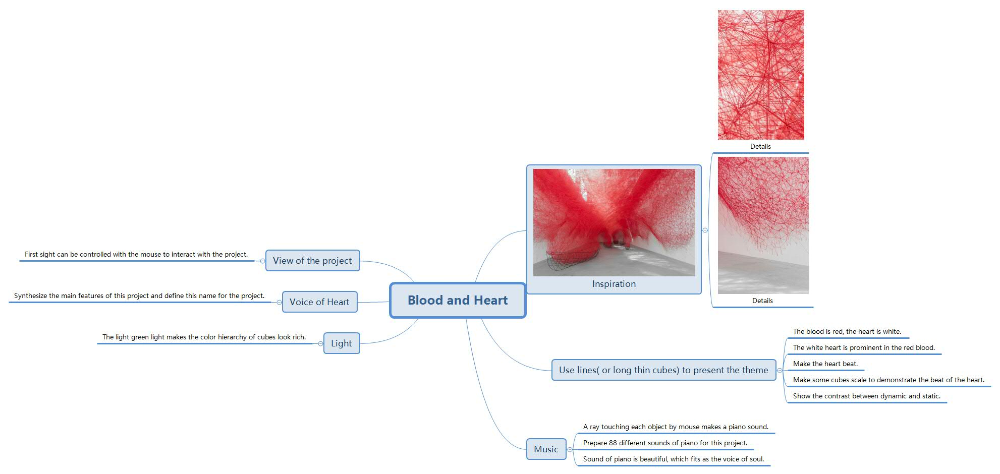
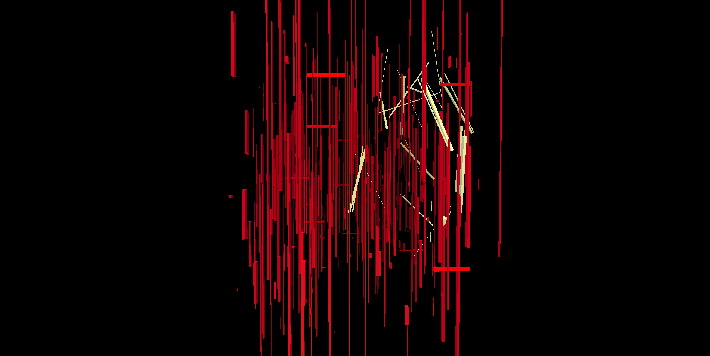
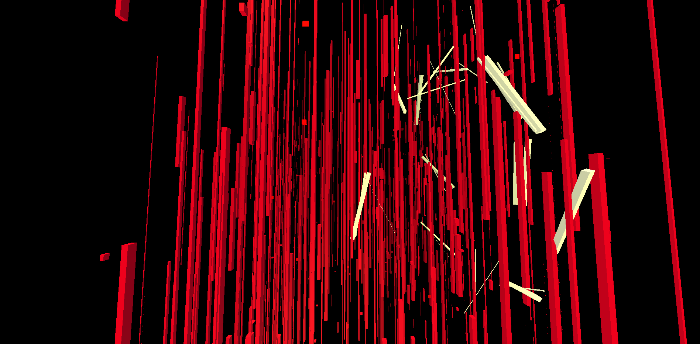
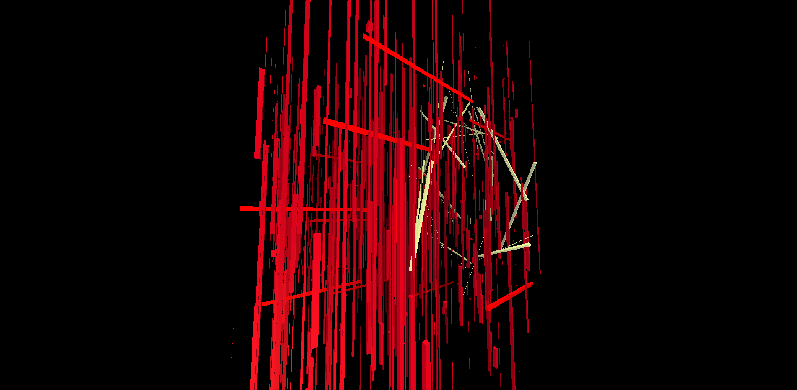
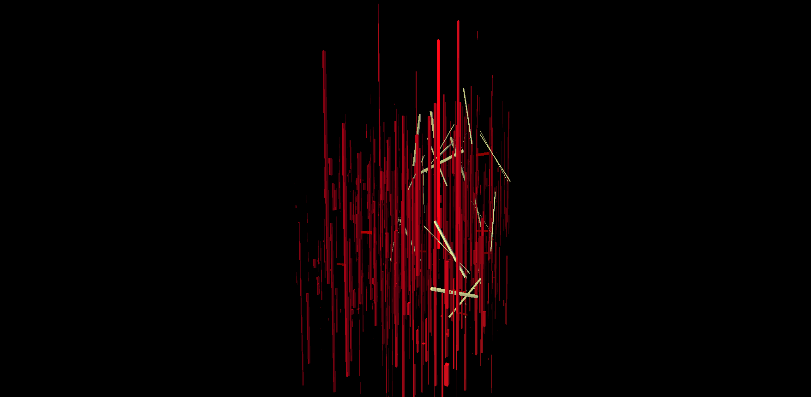
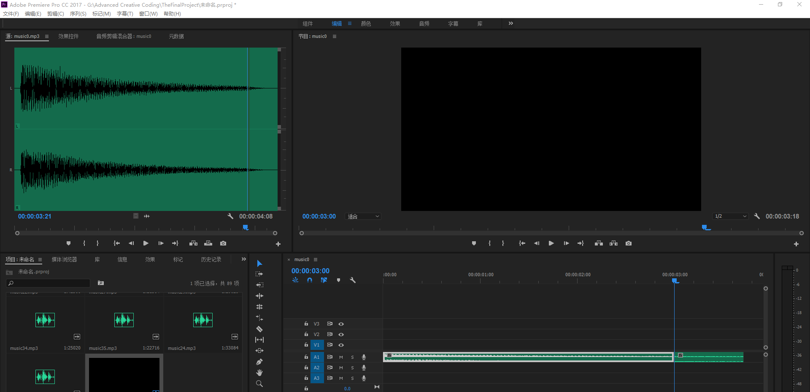
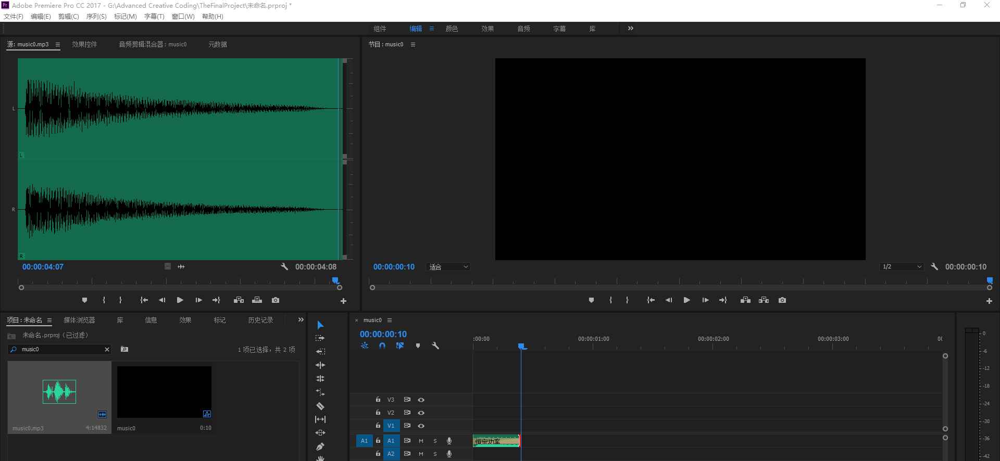

# The final project named **Voice of Heart**

### The creator: WANG ZHIMING.
### The student id:B161006091.

## Introduction

* The project is the final project shows many long thin cubes in the scene. The project is an audiovisual interactive composition.

* The player can interact with the project across first sight by moving mouse. Meanwhile, the player can click the left mouse button to close the field of view, and click the right mouse button to pull the far field of view. When player moves mouse to select the cube, the sound of piano will be played. There are 88 different sounds of piano prepared in this project. Every time player moves mouse to select the cube, the color of the cube will turn to red and the random sound will be played.

* The project looks abstract. The cubes as blood are static. The cubes as heart and heartbeat are dynamic.There is a contast between static and dynamic, which makes the project hierarchy look rich.

* The colors of heartbeat and blood are different kinds of red, meanwhile the color of light is a complementary color to red. The color of heart is white, which makes heart look prominent among the red cubes. The color of background and fog is black, which creates a strong visual impact for player. Meanwhile, the black fog makes the near cubes clear and the far ones dark and blurry. To sum up, these contrasts of color make the project hierarchy look rich.

* There is a special meaning of the project. When different players interact with the project, they can play unique voice of heart. The voice of heart like the vioce of the soul. Everybody has unique soul and voice of the soul. The meaning of project is that everyone can play unique voice of soul across the project.

---

## The project concept

<p align="center">

</p>

---

## The final general view of project
  <p align="center">
  
  
  
  
  </p>

---

## Code

#### This part explains the code used for the **index.js**

* The following code defines some global variables

```JavaScript
// GLOBALS ======================================================
var container, stats;
var camera, scene, raycaster, renderer;
var controls, clock;
var INV_MAX_FPS = 1 / 100, frameDelta = 0;

var mouse = new THREE.Vector2(), INTERSECTED;
var radius = 100, theta = 0;
var object;

//create array for cube
var cubes = [];

// create an AudioListener and add it to the camera
var listener = new THREE.AudioListener();

// create a global audio source
var sound = new THREE.Audio( listener );

//get the control with id audio1
var audio=document.getElementById('audio1');
    audio.autoplay='autoplay';

// load a sound and set it as the Audio object's buffer
var audioLoader = new THREE.AudioLoader();
```

* The following code creats container, a camera, a scene, fog, light, audioLoader.

```JavaScript
container = document.createElement( 'div' );//create a container and add div to container
document.body.appendChild( container );//add container to the end of body

//creat a camera and set position of camera
camera = new THREE.PerspectiveCamera( 100, window.innerWidth / window.innerHeight, 1, 10000 );//create the camera
camera.position.x = -800;//set the position of x
camera.position.y = 0;//set the position of y
camera.position.z = 0;//set the position of z

//Audio - Settings
camera.add( listener );

//creat a scene and set color of background and set fog
scene = new THREE.Scene();//create the scene
scene.background = new THREE.Color( 0x000000 );//set the color of background
scene.fog = new THREE.FogExp2(0x000000, 0.001);//set the color and thickness of the fog

//creat ambientLight in the scene
var ambientLight = new THREE.AmbientLight(0x999999 );
scene.add(ambientLight);//add ambientLight to scene

//set color and position of light
var lights = [];//create array of light
lights[0] = new THREE.DirectionalLight( 0xB8C43A, 0.6 );//set color and strength of light
lights[0].position.set( 1, 2, -0.5);//set the position of light
lights[1] = new THREE.DirectionalLight( 0xB8C43A, 0.3 );//set color and strength of light
lights[1].position.set( 1, -1, 0.5 );//set the position of light
lights[2] = new THREE.DirectionalLight( 0xB8C43A, 0.7 );//set color and strength of light
lights[2].position.set( -1., -1, -0.1 );//set the position of light
lights[3] = new THREE.DirectionalLight( 0xB8C43A, 0.8 );//set color and strength of light
lights[3].position.set( -1., 2, -1 );//set the position of light
  //add light to scene
scene.add( lights[0] );
scene.add( lights[1] );
scene.add( lights[2] );
scene.add( lights[3] );

//create audioLoader to load random music
var audioLoader = new THREE.AudioLoader();
//load random usic from folder named audio
  audioLoader.load( "audio/music" + Math.floor(Math.random()*87) + ".mp3", function( buffer ) {
  sound.setBuffer( buffer );//Date storage
  sound.setLoop( false );//Do not loop the music
  sound.setVolume( 0.5 );//set the volume of music
  sound.play();//play the audio
});
```

* The following code creates geometry and material firstly. secondly, the code creats mesh to combin material and geometry, meanwhile it sets scale, position, rotation of the mesh. Thirdly, the code adds mesh to scene and push mesh to **cubes**. Fifthly, the code creats raycaster and renderer and controls.

```JavaScript
//set 800 cubes in the Scene
  for (var i = 0; i < 800; i++) {
    //create cubes for blood and heart
    var geometry = new THREE.CubeGeometry( 1, 1, 1 );
    //create the material for cubes
    var material = new THREE.MeshPhongMaterial({overdraw: true, color: 0xCF0125});

   //create mesh to combin geometry and material
   var mesh = new THREE.Mesh(geometry, material);

  //Randomize position and scale of mesh
    mesh.position.x = Math.floor( Math.random() * 200 - 100 ) * 4;
    mesh.position.y = Math.floor( Math.random() * 200 - 100 ) * 4;
    mesh.position.z = Math.floor( Math.random() * 200 - 100 ) * 4;
    mesh.scale.x  = Math.pow(Math.random(), 2 ) * 10;
    mesh.scale.y  = Math.pow(Math.random(), 3 ) * 1000;
    mesh.scale.z  = mesh.scale.x;

  //Cast shadows of the models
    mesh.castShadow = true;
    mesh.receiveShadow = true;

  //add mesh to Scene
    scene.add(mesh);
  //push mesh to cubes
    cubes.push(mesh);

  }

//create the raycaster
  raycaster = new THREE.Raycaster();

//set different renderer
  renderer = new THREE.WebGLRenderer();//create the renderer
  renderer.setPixelRatio( window.devicePixelRatio );//render Proportion of Device Physical Pixels and Device Independent Pixels
  renderer.setSize( window.innerWidth, window.innerHeight );//render the size of window
  renderer.shadowMapEnabled = true;//render the shandow
  renderer.setClearColor(0x000000, 1);//set the color of background
  container.appendChild( renderer.domElement );//add renderer.domElement to the end of container

//Event execution: mousemove and use function onDocumentMouseMove firstly, then document.onclick, finally addEventListener
  document.addEventListener( 'mousemove', onDocumentMouseMove, false );
  //Event execution: resize and use function onWindowResize firstly, then document.onclick, finally addEventListener
  window.addEventListener( 'resize', onWindowResize, false );
```

* In the following codes, it renders and sets controls.

```JavaScript
function setup() {

  setupThreeJS();//retrieval the function

//render the following animation
  requestAnimationFrame(function animate() {

    frameDelta += clock.getDelta();
    while (frameDelta >= INV_MAX_FPS) {
      update(INV_MAX_FPS);
      frameDelta -= INV_MAX_FPS;
    }

//render the animate
    requestAnimationFrame( animate );
  });
}

//create controls for FirstPersonControls and set some value of controls
function setupThreeJS() {
  clock = new THREE.Clock();//create the clock
  controls = new THREE.FirstPersonControls(camera);//make controls to control the camera
  controls.movementSpeed = 100;//define speed of moving
  controls.lookSpeed = 0.08;//define the lookspeed
}

```

* In the following function, the code makes some cubes' scale become bigger and smaller again and again. Meanwhile, the code sets color and rotation and position of those cubes.

```JavaScript
//define scaleCube, scaleCube1
var scaleCube = 50;
var scaleCube1 = 10;

function drawFrame(){
  requestAnimationFrame(drawFrame);//render the drawFrame

  scaleCube += 12.5; // Start from 50 and sequentially plus 12.5 every time
  if (scaleCube > 500) scaleCube = 50;

  scaleCube1 += 50; // Start from 10 and sequentially plus 50 every time
  if (scaleCube1 > 500) scaleCube1 = 10;

//forEach takes all the arrary entries and passes the c as the ...
  cubes.forEach(function(c, i){

//set some of cubes's material and position and rotation and scale
//The mind shape of the heart
  cubes[0].material = new THREE.MeshPhongMaterial({overdraw: true, color: 0xFFFFFF});
  cubes[0].position.x = -200;
  cubes[0].position.y = 0;
  cubes[0].position.z = 0;
  cubes[0].rotation.x = 0.05 * Math.PI;
  cubes[0].rotation.y = 0;
  cubes[0].rotation.z = 0;
  cubes[0].scale.y = scaleCube;

  cubes[1].material = new THREE.MeshPhongMaterial({overdraw: true, color: 0xFFFFFF});
  cubes[1].position.x = -200;
  cubes[1].position.y = 0;
  cubes[1].position.z = 50;
  cubes[1].rotation.x = 0.85 * Math.PI;
  cubes[1].rotation.y = 0;
  cubes[1].rotation.z = 0;
  cubes[1].scale.y = scaleCube;

  cubes[2].material = new THREE.MeshPhongMaterial({overdraw: true, color: 0xFFFFFF});
  cubes[2].position.x = -200;
  cubes[2].position.y = 300;
  cubes[2].position.z = 200;
  cubes[2].rotation.x = -55.3;
  cubes[2].rotation.y = 0;
  cubes[2].rotation.z = 0;
  cubes[2].scale.y = scaleCube;

  cubes[3].material = new THREE.MeshPhongMaterial({overdraw: true, color: 0xFFFFFF});
  cubes[3].position.x = -200;
  cubes[3].position.y = 300;
  cubes[3].position.z = 400;
  cubes[3].rotation.x = 0.85 * Math.PI;
  cubes[3].rotation.y = 0;
  cubes[3].rotation.z = 0;
  cubes[3].scale.y = scaleCube;

  cubes[4].material = new THREE.MeshPhongMaterial({overdraw: true, color: 0xFFFFFF});
  cubes[4].position.x = -200;
  cubes[4].position.y = 80;
  cubes[4].position.z = 400;
  cubes[4].rotation.x = 0.02 * Math.PI;
  cubes[4].rotation.y = 0;
  cubes[4].rotation.z = 0;
  cubes[4].scale.y = scaleCube;

  cubes[5].material = new THREE.MeshPhongMaterial({overdraw: true, color: 0xFFFFFF});
  cubes[5].position.x = -200;
  cubes[5].position.y = -200;
  cubes[5].position.z = 300;
  cubes[5].rotation.x = 0.2 * Math.PI;
  cubes[5].rotation.y = 0;
  cubes[5].rotation.z = 0;
  cubes[5].scale.y = scaleCube;

//set some of cubes's material and position and rotation and scale
//The right blood wessel of the heart
  cubes[6].material = new THREE.MeshPhongMaterial({overdraw: true, color: 0xFFFFFF});
  cubes[6].position.x = -200;
  cubes[6].position.y = 400;
  cubes[6].position.z = 100;
  cubes[6].rotation.x = 0.05 * Math.PI;
  cubes[6].rotation.y = 0;
  cubes[6].rotation.z = 0;
  cubes[6].scale.y = scaleCube;

  cubes[7].material = new THREE.MeshPhongMaterial({overdraw: true, color: 0xFFFFFF});
  cubes[7].position.x = -200;
  cubes[7].position.y = 400;
  cubes[7].position.z = 180;
  cubes[7].rotation.x = -(0.05 * Math.PI);
  cubes[7].rotation.y = 0;
  cubes[7].rotation.z = 0;
  cubes[7].scale.y = scaleCube;

//set some of cubes's material and position and rotation and scale
//The left blood vessel of the heart
  cubes[9].material = new THREE.MeshPhongMaterial({overdraw: true, color: 0xFFFFFF});
  cubes[9].position.x = -200;
  cubes[9].position.y = 350;
  cubes[9].position.z = 200;
  cubes[9].rotation.x = 0.2 * Math.PI;
  cubes[9].rotation.y = 0;
  cubes[9].rotation.z = 0;
  cubes[9].scale.y = scaleCube;

  cubes[11].material = new THREE.MeshPhongMaterial({overdraw: true, color: 0xFFFFFF});
  cubes[11].position.x = -200;
  cubes[11].position.y = 450;
  cubes[11].position.z = 310;
  cubes[11].rotation.x = -(0.05 * Math.PI);
  cubes[11].rotation.y = 0;
  cubes[11].rotation.z = 0;
  cubes[11].scale.y = scaleCube;

//set some of cubes's material and position and rotation and scale
//The top of the heart
  cubes[12].material = new THREE.MeshPhongMaterial({overdraw: true, color: 0xFFFFFF});
  cubes[12].position.x = -200;
  cubes[12].position.y = 350;
  cubes[12].position.z = 230;
  cubes[12].rotation.x = 0;
  cubes[12].rotation.y = 0;
  cubes[12].rotation.z = 0.7 * Math.PI;
  cubes[12].scale.y = scaleCube;

//set some of cubes's material and position and rotation and scale
//The front side of the heart
  cubes[13].material = new THREE.MeshPhongMaterial({overdraw: true, color: 0xFFFFFF});
  cubes[13].position.x = -350;
  cubes[13].position.y = 200;
  cubes[13].position.z = 230;
  cubes[13].rotation.x = -(0.06 * Math.PI);
  cubes[13].rotation.y = 0;
  cubes[13].rotation.z = 0.9 * Math.PI;
  cubes[13].scale.y = scaleCube;

  cubes[14].material = new THREE.MeshPhongMaterial({overdraw: true, color: 0xFFFFFF});
  cubes[14].position.x = -350;
  cubes[14].position.y = 0;
  cubes[14].position.z = 300;
  cubes[14].rotation.x = -(0.2 * Math.PI);
  cubes[14].rotation.y = 0;
  cubes[14].rotation.z = -(0.85 * Math.PI);
  cubes[14].scale.y = scaleCube;

  cubes[15].material = new THREE.MeshPhongMaterial({overdraw: true, color: 0xFFFFFF});
  cubes[15].position.x = -280;
  cubes[15].position.y = -150;
  cubes[15].position.z = 300;
  cubes[15].rotation.x = -(0.2 * Math.PI);
  cubes[15].rotation.y = 0;
  cubes[15].rotation.z = -(0.7 * Math.PI);
  cubes[15].scale.y = scaleCube;

//set some of cubes's material and position and rotation and scale
//The back of the heart
  cubes[16].material = new THREE.MeshPhongMaterial({overdraw: true, color: 0xFFFFFF});
  cubes[16].position.x = -50;
  cubes[16].position.y = 350;
  cubes[16].position.z = 230;
  cubes[16].rotation.x = -(0.06 * Math.PI);
  cubes[16].rotation.y = 0;
  cubes[16].rotation.z = -(0.8 * Math.PI);
  cubes[16].scale.y = scaleCube;

  cubes[17].material = new THREE.MeshPhongMaterial({overdraw: true, color: 0xFFFFFF});
  cubes[17].position.x = 0;
  cubes[17].position.y = 100;
  cubes[17].position.z = 300;
  cubes[17].rotation.x = -(0.1 * Math.PI);
  cubes[17].rotation.y = 0;
  cubes[17].rotation.z = 0.9 * Math.PI;
  cubes[17].scale.y = scaleCube;

  cubes[18].material = new THREE.MeshPhongMaterial({overdraw: true, color: 0xFFFFFF});
  cubes[18].position.x = 0;
  cubes[18].position.y = -150;
  cubes[18].position.z = 300;
  cubes[18].rotation.x = -(0.2 * Math.PI);
  cubes[18].rotation.y = 0;
  cubes[18].rotation.z = 0.7 * Math.PI;
  cubes[18].scale.y = scaleCube;

//set some of cubes's material and position and rotation and scale
//The second mind shape of the heart
  cubes[19].material = new THREE.MeshPhongMaterial({overdraw: true, color: 0xFFFFFF});
  cubes[19].position.x = -220;
  cubes[19].position.y = 0;
  cubes[19].position.z = 0;
  cubes[19].rotation.x = 0.08 * Math.PI;
  cubes[19].rotation.y = 0;
  cubes[19].rotation.z = 0;
  cubes[19].scale.y = scaleCube;

  cubes[20].material = new THREE.MeshPhongMaterial({overdraw: true, color: 0xFFFFFF});
  cubes[20].position.x = -180;
  cubes[20].position.y = 0;
  cubes[20].position.z = 50;
  cubes[20].rotation.x = 0.83 * Math.PI;
  cubes[20].rotation.y = 0;
  cubes[20].rotation.z = 0;
  cubes[20].scale.y = scaleCube;

  cubes[21].material = new THREE.MeshPhongMaterial({overdraw: true, color: 0xFFFFFF});
  cubes[21].position.x = -220;
  cubes[21].position.y = 300;
  cubes[21].position.z = 200;
  cubes[21].rotation.x = 0.87 * Math.PI;
  cubes[21].rotation.y = 0;
  cubes[21].rotation.z = 0;
  cubes[21].scale.y = scaleCube;

  cubes[22].material = new THREE.MeshPhongMaterial({overdraw: true, color: 0xFFFFFF});
  cubes[22].position.x = -180;
  cubes[22].position.y = 300;
  cubes[22].position.z = 400;
  cubes[22].rotation.x = 0.83 * Math.PI;
  cubes[22].rotation.y = 0;
  cubes[22].rotation.z = 0;
  cubes[22].scale.y = scaleCube;

  cubes[23].material = new THREE.MeshPhongMaterial({overdraw: true, color: 0xFFFFFF});
  cubes[23].position.x = -220;
  cubes[23].position.y = 80;
  cubes[23].position.z = 400;
  cubes[23].rotation.x = 0.04 * Math.PI;
  cubes[23].rotation.y = 0;
  cubes[23].rotation.z = 0;
  cubes[23].scale.y = scaleCube;

  cubes[24].material = new THREE.MeshPhongMaterial({overdraw: true, color: 0xFFFFFF});
  cubes[24].position.x = -180;
  cubes[24].position.y = -200;
  cubes[24].position.z = 300;
  cubes[24].rotation.x = 0.01 * Math.PI;
  cubes[24].rotation.y = 0;
  cubes[24].rotation.z = 0;
  cubes[24].scale.y = scaleCube;

//set some of cubes's material and position and rotation and scale
//The second top of the heart
  cubes[25].material = new THREE.MeshPhongMaterial({overdraw: true, color: 0xFFFFFF});
  cubes[25].position.x = -200;
  cubes[25].position.y = 280;
  cubes[25].position.z = 100;
  cubes[25].rotation.x = 0;
  cubes[25].rotation.y = 0;
  cubes[25].rotation.z = 0.8 * Math.PI;
  cubes[25].scale.y = scaleCube;

//set some of cubes's material and position and rotation and scale
//The third top of the heart
  cubes[26].material = new THREE.MeshPhongMaterial({overdraw: true, color: 0xFFFFFF});
  cubes[26].position.x = -200;
  cubes[26].position.y = 350;
  cubes[26].position.z = 290;
  cubes[26].rotation.x = 0;
  cubes[26].rotation.y = 0;
  cubes[26].rotation.z = 0.8 * Math.PI;
  cubes[26].scale.y = scaleCube;

//set some of cubes's material and position and rotation and scale
//The second front side of the heart
  cubes[27].material = new THREE.MeshPhongMaterial({overdraw: true, color: 0xFFFFFF});
  cubes[27].position.x = -350;
  cubes[27].position.y = 200;
  cubes[27].position.z = 220;
  cubes[27].rotation.x = -(0.07 * Math.PI);
  cubes[27].rotation.y = 0;
  cubes[27].rotation.z = 0.9 * Math.PI;
  cubes[27].scale.y = scaleCube;

  cubes[28].material = new THREE.MeshPhongMaterial({overdraw: true, color: 0xFFFFFF});
  cubes[28].position.x = -350;
  cubes[28].position.y = 0;
  cubes[28].position.z = 310;
  cubes[28].rotation.x = -(0.1 * Math.PI);
  cubes[28].rotation.y = 0;
  cubes[28].rotation.z = -(0.85 * Math.PI);
  cubes[28].scale.y = scaleCube;

  cubes[29].material = new THREE.MeshPhongMaterial({overdraw: true, color: 0xFFFFFF});
  cubes[29].position.x = -280;
  cubes[29].position.y = -150;
  cubes[29].position.z = 300;
  cubes[29].rotation.x = -(0.3 * Math.PI);
  cubes[29].rotation.y = 0;
  cubes[29].rotation.z = -(0.7 * Math.PI);
  cubes[29].scale.y = scaleCube;

//set some of cubes's material and position and rotation and scale
//The second back of the heart
  cubes[30].material = new THREE.MeshPhongMaterial({overdraw: true, color: 0xFFFFFF});
  cubes[30].position.x = -50;
  cubes[30].position.y = 350;
  cubes[30].position.z = 220;
  cubes[30].rotation.x = -(0.05 * Math.PI);
  cubes[30].rotation.y = 0;
  cubes[30].rotation.z = -(0.8 * Math.PI);
  cubes[30].scale.y = scaleCube;

  cubes[31].material = new THREE.MeshPhongMaterial({overdraw: true, color: 0xFFFFFF});
  cubes[31].position.x = 0;
  cubes[31].position.y = 100;
  cubes[31].position.z = 310;
  cubes[31].rotation.x = -(0.2 * Math.PI);
  cubes[31].rotation.y = 0;
  cubes[31].rotation.z = 0.9 * Math.PI;
  cubes[31].scale.y = scaleCube;

  cubes[32].material = new THREE.MeshPhongMaterial({overdraw: true, color: 0xFFFFFF});
  cubes[32].position.x = 0;
  cubes[32].position.y = -150;
  cubes[32].position.z = 290;
  cubes[32].rotation.x = -(0.1 * Math.PI);
  cubes[32].rotation.y = 0;
  cubes[32].rotation.z = 0.7 * Math.PI;
  cubes[32].scale.y = scaleCube;

//set some of cubes's material and position and scale
//other heartbeat
  cubes[33].material = new THREE.MeshPhongMaterial({overdraw: true, color: 0xFF0000});
  cubes[33].position.y = Math.floor( Math.random() * 200 - 100 ) * 4;
  cubes[33].scale.y = 10;
  cubes[33].scale.z = scaleCube1;

  cubes[34].material = new THREE.MeshPhongMaterial({overdraw: true, color: 0xFF0000});
  cubes[34].scale.y = 10;
  cubes[34].scale.z = scaleCube1;

  cubes[35].material = new THREE.MeshPhongMaterial({overdraw: true, color: 0xFF0000});
  cubes[35].scale.y = 10;
  cubes[35].scale.z = scaleCube1;

  cubes[36].material = new THREE.MeshPhongMaterial({overdraw: true, color: 0xFF0000});
  cubes[36].scale.y = 10;
  cubes[36].scale.z = scaleCube1;

  cubes[37].material = new THREE.MeshPhongMaterial({overdraw: true, color: 0xFF0000});
  cubes[37].scale.y = 10;
  cubes[37].scale.z = scaleCube1;

  cubes[38].material = new THREE.MeshPhongMaterial({overdraw: true, color: 0xFF0000});
  cubes[38].scale.y = 10;
  cubes[38].scale.z = scaleCube1;

  cubes[39].material = new THREE.MeshPhongMaterial({overdraw: true, color: 0xFF0000});
  cubes[39].scale.y = 10;
  cubes[39].scale.z = scaleCube1;

  cubes[40].material = new THREE.MeshPhongMaterial({overdraw: true, color: 0xFF0000});
  cubes[40].scale.y = 10;
  cubes[40].scale.z = scaleCube1;

  cubes[41].material = new THREE.MeshPhongMaterial({overdraw: true, color: 0xFF0000});
  cubes[41].scale.y = 10;
  cubes[41].scale.z = scaleCube1;

  cubes[42].material = new THREE.MeshPhongMaterial({overdraw: true, color: 0xFF0000});
  cubes[42].scale.y = 10;
  cubes[42].scale.z = scaleCube1;

});

}

```

* The following function renders each thing.

```JavaScript
function onWindowResize() {
  camera.aspect = window.innerWidth / window.innerHeight;//set aspect of camera
  camera.updateProjectionMatrix();//refresh the view
  renderer.setSize( window.innerWidth, window.innerHeight );//render the size
}

function onDocumentMouseMove( event ) {
  event.preventDefault();//Default action to cancel time
  mouse.x = ( event.clientX / window.innerWidth ) * 2 - 1;//set x of mouse
  mouse.y = - ( event.clientY / window.innerHeight ) * 2 + 1;//set y of mouse
}

//render each thing
function animate() {
  requestAnimationFrame( animate );//render the animate

  render();//retrieval the function

}

//create the count
var count = 0;

function render() {

//There are 10 frames between each detection.
  count ++;
    if(count > 10){
      count = 0;

  //Find intersections
  raycaster.setFromCamera( mouse, camera );

//create intersects and make it can select cubes
  var intersects = raycaster.intersectObjects( cubes, true );

  if ( intersects.length > 0 ) {
    if ( INTERSECTED != intersects[ 0 ].object ) {
      if ( INTERSECTED ) INTERSECTED.material.emissive.setHex( INTERSECTED.currentHex );
      INTERSECTED = intersects[ 0 ].object;
      INTERSECTED.currentHex = INTERSECTED.material.emissive.getHex();
      INTERSECTED.material.emissive.setHex( 0xff0000 );//make cubes be red

      //play random music
      audio.src="audio/music" + Math.floor(Math.random()*87) + ".mp3";


    }
  } else {
    if ( INTERSECTED ) INTERSECTED.material.emissive.setHex( INTERSECTED.currentHex );
    INTERSECTED = null;//Cubes would return to original color

  }
}

  renderer.render( scene, camera );//render scene and camera
}

function update(delta) {
  controls.update(delta);
}
```

* Run function render

```JavaScript
//Run function render
init();
animate();
setup();
drawFrame();
```

#### This part explains the code used for the **index.html**

* The following code imports **three.min.js** and **index.js** and **FirstPersonControls.js**. For this project, a few dependencies are needed, which can be found in the folder named **libraries**. The **three.js** and **FirstPersonControls.js** are found in the **Library**.

```JavaScript
<!DOCTYPE html>
<html lang="en" >
  <head>
    <meta charset="UTF-8" />
    <title>Three.js</title>
      <!--  Simple reset to delete the margins  -->
      <style>
        body {
          margin: 0;
        }
        canvas { width: 100%; height: 100% }
      </style>
      <!--  Three.js CDN  -->
      <!-- <script src="https://cdnjs.cloudflare.com/ajax/libs/three.js/96/three.min.js"></script>-->
      <script src="build/three.min.js"></script>
      <script src="js/FirstPersonControls.js"></script>

  </head>
  <body>
     <audio id ="audio1" src=""></audio>
    <!--  Our code  -->
    <script src="js/index.js"></script>
  </body>
</html>
```

---

## Music

The sounds of piano has been corrected to make voice of piano listen more fluent. At the beginning, the speed of selecting each cube is very slow. The player must waite for finishing of one sound playing, then player can select another cube and play another sound. That makes it very late and inflexible for players to interact with the project. So I modify the piano audio to make interaction be more fluent.

<p align="center">


</p>

---

## The content of each folder

* The folder named **TheFinalProject** includes the main folder named **VOICE of HEART**.

* The folder named **VOICE of HEART** has all files in it.

* All pictures are in the folder named **assets**.

* All files of music are in the folder named **audio**.

* The **three.min.js** and **perlin.js** is in the folder named **build**.

* The **style.css** is in the folder named **css**.

* The **controls.js** and **FirstPersonControls.js** and **index.js** are in the folder named **js**.

* The **index.html** and **README.md** are in the folder named **VOICE of HEART**.

---

## Matters needing attention

* The project sometimes cannot be refreshed in the Google browser because some problems of Google browser. It can be refreshed in other browers.

* When opening the project, you need to pay attetion to the correct path to open, or it will fail to open.

---

## The GitHub link : [https://github.com/Astrid1005/DAT505-GitHub.git](https://github.com/Astrid1005/DAT505-GitHub.git)

---
