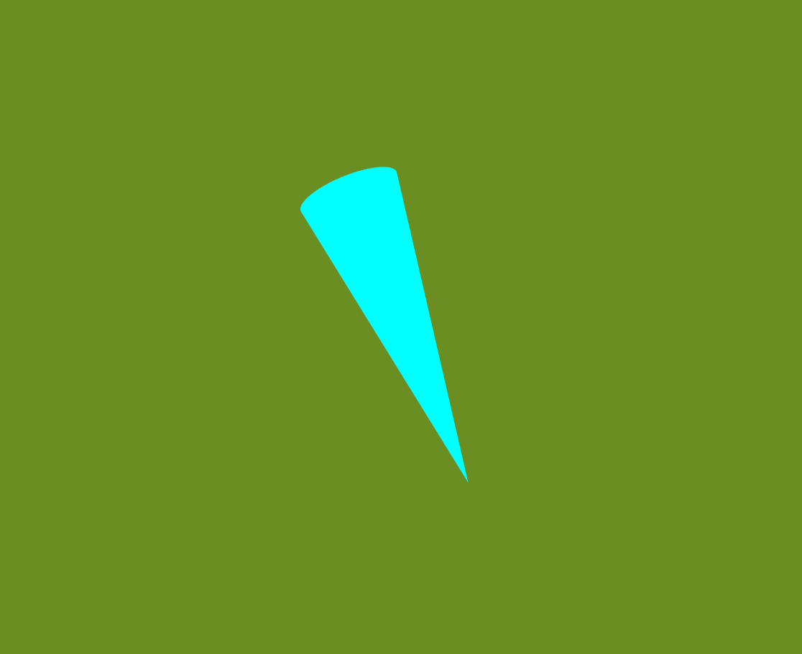

# A class exercise which needed to change the color and shape of the basic geometry and the color of background.

## Introduction

The project is a class exercise which is given by the teacher. I changed the color of background and the basic geometry to complete the exercise. The exercise shows a cone in the middle of scene. The cone is in a rotating loop. The project is a class exercise of changing basic geometry and color and geometry's rotation.

---

## Code

#### This part explains the code used for the **index.js**

* The following code defines some global variables

```JavaScript
//Global variables
var scene, camera, renderer;
var geometry, material, mesh;
```

* The following function creates an empty scene, a basic perspective camera, a renderer. This renderer configures the color of background and the size of window. In the following code, I changed the original color of the background.

```JavaScript
function init(){
  // Create an empty scene --------------------------
  scene = new THREE.Scene();

  // Create a basic perspective camera --------------
  camera = new THREE.PerspectiveCamera(35, window.innerWidth/window.innerHeight, 300, 10000 );

  // Create a renderer with Antialiasing ------------
  renderer = new THREE.WebGLRenderer({antialias:true});

  // Configure renderer clear color
  renderer.setClearColor("#6B8E23");

  // Configure renderer size
  renderer.setSize( window.innerWidth, window.innerHeight );

  // Append Renderer to DOM
  document.body.appendChild( renderer.domElement );
}
```

* This function  creates a cone and basic material firstly. Then the code creates mesh to combine the cone with material. Finally, the code defines the position of the mesh and adds the mesh to scene. In the following code, I changed the basic geometry and the color of geometry.

```JavaScript
function geometry(){
  // Create a Cube Mesh with basic material ---------
  geometry = new THREE.ConeGeometry(50, 300, 50);
  material = new THREE.MeshBasicMaterial( { color: "#00FFFF" } );
  mesh = new THREE.Mesh( geometry, material );
  mesh.position.z = -1000;

  // Add mesh to scene
  scene.add( mesh );
}
```

* In the loop function, the code makes the mesh rotate in the loop. Finally, the renderer renders the scene.

```JavaScript
// Render Loop
// Render Loop
var render = function () {
  requestAnimationFrame( render );

  mesh.rotation.z += 0.05; //Continuously rotate the mesh
  mesh.rotation.y += 0.05;

  renderer.setClearColor("#6B8E23");

  // Render the scene
  renderer.render(scene, camera);
};
```

* Run function render

```JavaScript
init();
geometry();
render();
```

#### This part explains the code used for the **index.html**

* The following code imports **three.js** and **index.js**. For this project, a few dependencies are needed, which can be found in the folder named **libraries**. The **three.js** is found in the **Library**.

```JavaScript
<!DOCTYPE html>
<html lang="en">
  <head>
    <meta charset="UTF-8" />
    <title>Three.js</title>
      <style>
         body { margin:0;}
         canvas { width: 100%; height: 100%}
       </style>
     <script src="build/three.js"></script>
   </head>
   <body>
     <script src="js/index.js"></script>
   </body>
  </html>
  ```

---

## The final general view of code
  <p align="center">
  
  
  
  </p>
