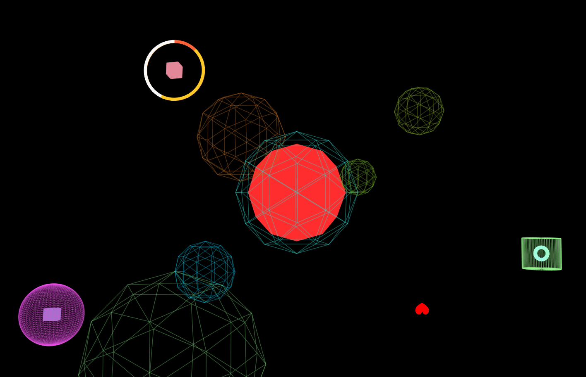

# A homework which needed to add different kinds of basic geometries in the scene.

## Introduction

The project is a homework which required me to add many different kinds of basic geometries in the scene. I added many different kinds of basic geometry to complete the homework. The homework project shows many different kinds of geometries in the scene. Each geometry is in a rotating loop.

---

## Code

#### This part explains the code used for the **index.js**

* The following code defines some global variables

```JavaScript
//Global variables
var scene, camera, renderer;
var geometry, material, mesh;
var geometry3, material3, wireframe3, line3;
var geometry5, material5, wireframe5, line5;
var geometry4, material4, mesh4;
var geometry6, material6, mesh6;
var geometry7, material7, mesh7;
var geometry8, material8, mesh8;
var geometry9, material9, mesh9;
var geometry10, material10, mesh10;
var geometry11, material11, wireframe11, line11;
var geometry12, material12, wireframe12, line12;
var geometry13, material13, wireframe13, line13;
var geometry14, material14, wireframe14, line14;
var geometry15, material15, wireframe15, line15;
var geometry16, material16, wireframe16, line16;
var geometry1, material1, mesh1;
var x = 0, y = 0;
var heartShape;
```

* The following function creates an empty scene, a basic perspective camera, a renderer. This renderer configures the color of background and the size of window.

```JavaScript
function init(){
  // Create an empty scene --------------------------
  scene = new THREE.Scene();

  // Create a basic perspective camera --------------
  camera = new THREE.PerspectiveCamera(35, window.innerWidth/window.innerHeight, 300, 10000 );

  // Create a renderer with Antialiasing ------------
  renderer = new THREE.WebGLRenderer({antialias:true});

  // Configure renderer clear color
  renderer.setClearColor("#000000");

  // Configure renderer size
  renderer.setSize( window.innerWidth, window.innerHeight );

  // Append Renderer to DOM
  document.body.appendChild( renderer.domElement );
}

```

* This function creates many different kinds of basic geometries and basic material firstly. Then the code creates meshes to combines the geometries with material. Finally, the code defines the position of the meshes and adds the meshes to scene. In the following code, I changed the basic geometry and the color of geometry.

```JavaScript
function geometry(){
  // Create a heartShape Mesh with basic material ---------
  heartShape = new THREE.Shape();

  heartShape.moveTo( x + 5, y + 5 );
  heartShape.bezierCurveTo( x + 5, y + 5, x + 4, y, x, y );
  heartShape.bezierCurveTo( x - 6, y, x - 6, y + 7,x - 6, y + 7 );
  heartShape.bezierCurveTo( x - 6, y + 11, x - 3, y + 15.4, x + 5, y + 19 );
  heartShape.bezierCurveTo( x + 12, y + 15.4, x + 16, y + 11, x + 16, y + 7 );
  heartShape.bezierCurveTo( x + 16, y + 7, x + 16, y, x + 10, y );
  heartShape.bezierCurveTo( x + 7, y, x + 5, y + 5, x + 5, y + 5 );

  geometry1 = new THREE.ShapeGeometry( heartShape );
  material1 = new THREE.MeshBasicMaterial( { color: "#FF0000" } );
  mesh1 = new THREE.Mesh( geometry1, material1 ) ;
  mesh1.position.z = -1000;
  mesh1.position.x = 200;
  mesh1.position.y = -200;
  scene.add( mesh1 );

  // Create a IcosahedronBufferGeometry Mesh with basic material ---------
  geometry4 = new THREE.IcosahedronBufferGeometry(80, 1);
  material4 = new THREE.MeshBasicMaterial( { color: "#FF2D2D" } );
  mesh4 = new THREE.Mesh( geometry4, material4 );
  mesh4.position.z = -1000;
  scene.add( mesh4 );

  // Create a BoxGeometry Mesh with basic material ---------
  geometry = new THREE.BoxGeometry(20, 20, 20);
  material = new THREE.MeshBasicMaterial( { color: "#927AC3" } );
  mesh = new THREE.Mesh( geometry, material );
  mesh.position.z = -1000;
  mesh.position.x = -400;
  mesh.position.y = -200;
  scene.add( mesh );

  // Create a BoxGeometry Mesh with basic material ---------
  geometry6 = new THREE.BoxGeometry(20, 20, 20);
  material6 = new THREE.MeshBasicMaterial( { color: "#E28899" } );
  mesh6 = new THREE.Mesh( geometry6, material6 );
  mesh6.position.z = -1000;
  mesh6.position.x = -200;
  mesh6.position.y = 200;
  scene.add( mesh6 );

  // Create a RingBufferGeometry Mesh with basic material ---------
  geometry7 = new THREE.RingBufferGeometry(45, 50, 320);
  material7 = new THREE.MeshBasicMaterial( { color: "#FFCA27", side: "THREE.DoubleSide" } );
  mesh7 = new THREE.Mesh( geometry7, material7 );
  mesh7.position.z = -1000;
  mesh7.position.x = -200;
  mesh7.position.y = 200;
  scene.add( mesh7 );

  // Create a RingBufferGeometry Mesh with basic material ---------
  geometry8 = new THREE.RingBufferGeometry(45, 50, 320);
  material8 = new THREE.MeshBasicMaterial( { color: "#FF6238", side: "THREE.DoubleSide" } );
  mesh8 = new THREE.Mesh( geometry8, material8 );
  mesh8.position.z = -1000;
  mesh8.position.x = -200;
  mesh8.position.y = 200;
  scene.add( mesh8 );

  // Create a RingBufferGeometry Mesh with basic material ---------
  geometry9 = new THREE.RingBufferGeometry(45, 50, 320);
  material9 = new THREE.MeshBasicMaterial( { color: "#FBF9F7", side: "THREE.DoubleSide" } );
  mesh9 = new THREE.Mesh( geometry9, material9 );
  mesh9.position.z = -1000;
  mesh9.position.x = -200;
  mesh9.position.y = 200;
  scene.add( mesh9 );

  // Create a TorusGeometry Mesh with basic material ---------
  geometry10 = new THREE.TorusGeometry(10, 3, 16,100);
  material10 = new THREE.MeshBasicMaterial( { color: "#A6FFFF" } );
  mesh10 = new THREE.Mesh( geometry10, material10 );
  mesh10.position.z = -1000;
  mesh10.position.x = 400;
  mesh10.position.y = -100;
  scene.add( mesh10 );

  // Create a IcosahedronBufferGeometry Mesh with basic material ---------
  geometry3 = new THREE.IcosahedronBufferGeometry(100, 1);
  wireframe3 = new THREE.WireframeGeometry( geometry3 );
  line3 = new THREE.LineSegments( wireframe3 );
  line3.material.depthTest = false;
  line3.material.opacity = 0.25;
  line3.material.transparent = true;
  line3.position.z = -1000;
  scene.add( line3 );

  // Create a SphereBufferGeometry Mesh with basic material ---------
  geometry5 = new THREE.SphereBufferGeometry(50, 50, 50);
  wireframe5 = new THREE.WireframeGeometry( geometry5 );
  line5 = new THREE.LineSegments( wireframe5 );
  line5.material.depthTest = false;
  line5.material.opacity = 0.25;
  line5.material.transparent = true;
  line5.position.z = -1000;
  line5.position.x = -400;
  line5.position.y = -200;
  scene.add( line5 );

  // Create a CylinderBufferGeometry Mesh with basic material ---------
  geometry11 = new THREE.CylinderBufferGeometry(30, 30, 50, 72);
  wireframe11 = new THREE.WireframeGeometry( geometry11 );
  line11 = new THREE.LineSegments( wireframe11 );
  line11.material.depthTest = false;
  line11.material.opacity = 0.25;
  line11.material.transparent = true;
  line11.position.z = -1000;
  line11.position.x = 400;
  line11.position.y = -100;
  scene.add( line11 );

  // Create a IcosahedronBufferGeometry Mesh with basic material ---------
  geometry12 = new THREE.IcosahedronBufferGeometry(80, 1);
  wireframe12 = new THREE.WireframeGeometry( geometry12 );
  line12 = new THREE.LineSegments( wireframe12 );
  line12.material.depthTest = false;
  line12.material.opacity = 0.25;
  line12.material.transparent = true;
  line12.position.z = -1100;
  line12.position.x = -100;
  line12.position.y = 100;
  scene.add( line12 );

  // Create a IcosahedronBufferGeometry Mesh with basic material ---------
  geometry13 = new THREE.IcosahedronBufferGeometry(150, 1);
  wireframe13 = new THREE.WireframeGeometry( geometry13 );
  line13 = new THREE.LineSegments( wireframe13 );
  line13.material.depthTest = false;
  line13.material.opacity = 0.25;
  line13.material.transparent = true;
  line13.position.z = -1000;
  line13.position.x = -200;
  line13.position.y = -280;
  scene.add( line13 );

  // Create a IcosahedronBufferGeometry Mesh with basic material ---------
  geometry14 = new THREE.IcosahedronBufferGeometry(60, 1);
  wireframe14 = new THREE.WireframeGeometry( geometry14 );
  line14 = new THREE.LineSegments( wireframe14 );
  line14.material.depthTest = false;
  line14.material.opacity = 0.25;
  line14.material.transparent = true;
  line14.position.z = -1500;
  line14.position.x = 300;
  line14.position.y = 200;
  scene.add( line14 );

  // Create a IcosahedronBufferGeometry Mesh with basic material ---------
  geometry15 = new THREE.IcosahedronBufferGeometry(30, 1);
  wireframe15 = new THREE.WireframeGeometry( geometry15 );
  line15 = new THREE.LineSegments( wireframe15 );
  line15.material.depthTest = false;
  line15.material.opacity = 0.25;
  line15.material.transparent = true;
  line15.position.z = -1000;
  line15.position.x = 100;
  line15.position.y = 25;
  scene.add( line15 );

  // Create a IcosahedronBufferGeometry Mesh with basic material ---------
  geometry16 = new THREE.IcosahedronBufferGeometry(50, 1);
  wireframe16 = new THREE.WireframeGeometry( geometry16 );
  line16 = new THREE.LineSegments( wireframe16 );
  line16.material.depthTest = false;
  line16.material.opacity = 0.25;
  line16.material.transparent = true;
  line16.position.z = -1000;
  line16.position.x = -150;
  line16.position.y = -130;
  scene.add( line16 );
}
```

* In the loop function, the code makes the meshes and lines rotate in the loop. Finally, the renderer renders the scene.

```JavaScript
// Render Loop
var render = function () {
  requestAnimationFrame( render );

  mesh.rotation.x += 0.10; //Continuously rotate the mesh
  mesh.rotation.y += 0.08;

  mesh1.rotation.x += 0.02; //Continuously rotate the mesh
  mesh1.rotation.y += 0.03;

  line3.rotation.x += 0.01; //Continuously rotate the mesh
  line3.rotation.y += 0.01;

  line5.rotation.x += 0.01; //Continuously rotate the mesh
  line5.rotation.y += 0.01;

  mesh4.rotation.x += 0.03; //Continuously rotate the mesh
  mesh4.rotation.y += 0.03;

  mesh6.rotation.x += 0.18; //Continuously rotate the mesh
  mesh6.rotation.y += 0.15;

  mesh7.rotation.x += 0.02; //Continuously rotate the mesh
  mesh7.rotation.y += 0.02;

  mesh8.rotation.y += 0.01; //Continuously rotate the mesh
  mesh8.rotation.x += 0.01;

  mesh9.rotation.z += 0.01; //Continuously rotate the mesh
  mesh9.rotation.x += 0.01;

  mesh10.rotation.z += 0.05; //Continuously rotate the mesh
  mesh10.rotation.x += 0.05;

  line11.rotation.x += 0.03; //Continuously rotate the mesh
  line11.rotation.y += 0.03;

  line12.rotation.x += 0.03; //Continuously rotate the mesh
  line12.rotation.y += 0.03;

  line13.rotation.x += 0.03; //Continuously rotate the mesh
  line13.rotation.y += 0.03;

  line14.rotation.x += 0.10; //Continuously rotate the mesh
  line14.rotation.y += 0.10;

  line15.rotation.x += 0.05; //Continuously rotate the mesh
  line15.rotation.y += 0.05;

  line16.rotation.x += 0.08; //Continuously rotate the mesh
  line16.rotation.y += 0.07;

  renderer.setClearColor("#000000");

  // Render the scene
  renderer.render(scene, camera);
};
```

* Adds functions

```JavaScript
init();
geometry();
render();
```

#### This part explains the code used for the **index.html**

* The following code imports **three.js** and **index.js**. For this project, a few dependencies are needed, which can be found in the folder named **libraries**. The **three.js** is found in the **Library**.

```JavaScript
<!DOCTYPE html>
<html lang="en">
  <head>
    <meta charset="UTF-8" />
    <title>Three.js</title>
      <style>
         body { margin:0;}
         canvas { width: 100%; height: 100%}
       </style>
     <script src="build/three.js"></script>
   </head>
   <body>
     <script src="js/index.js"></script>
   </body>
  </html>
  ```

  ## The final general view of code
    <p align="center">
    
    </p>
