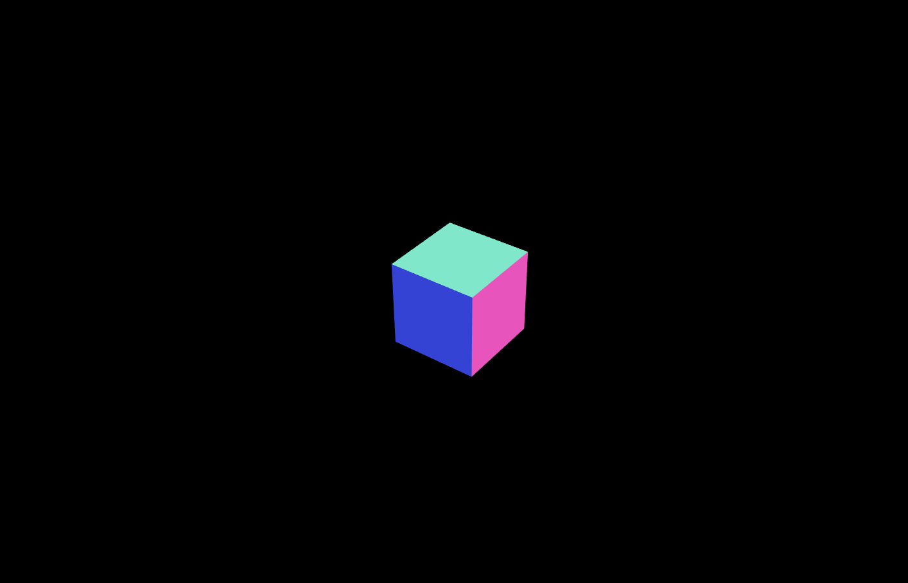
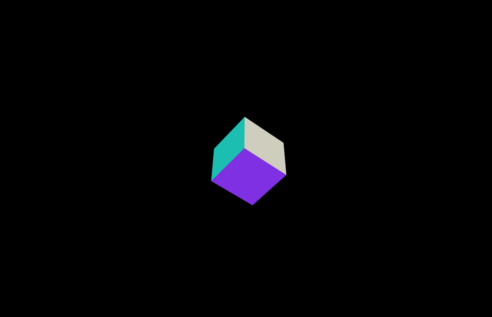

# An example which was given by teacher.

## Introduction

The project is an example which shows that a cube with MeshNormalMaterial rotates in the scene.

---

## Code

#### This part explains the code used for the **index.js**

* The following code defines some global variables

```JavaScript
//Global variables
var scene, camera, renderer;
var geometry, material, mesh;
```

* The following function creates an empty scene, a basic perspective camera, a renderer. This renderer configures the color of background and the size of window.

```JavaScript
function init(){
  // Create an empty scene --------------------------
  scene = new THREE.Scene();

  // Create a basic perspective camera --------------
  camera = new THREE.PerspectiveCamera(35, window.innerWidth / window.innerHeight, 300, 10000 );

  // Create a renderer with Antialiasing ------------
  renderer = new THREE.WebGLRenderer({antialias:true});

  // Configure renderer clear color
  renderer.setClearColor("#000000");

  // Configure renderer size
  renderer.setSize( window.innerWidth, window.innerHeight );

  // Append Renderer to DOM
  document.body.appendChild( renderer.domElement );
}
```

* The following function creates light1 and light2, meanwhile it adds light1 and light2 in the scene. Secondly, the function creats geometry and material. Then the code creates mesh to combine the geometry with material. Finally, the code defines the position of the mesh and adds the mesh to scene.

```JavaScript
function geometry(){
  // Configure lights -------------------------------
  var light1 = new THREE.AmbientLight(0xffffff, 0.5);
  scene.add(light1);

  var light2 = new THREE.PointLight(0xffffff, 0.5);
  scene.add(light2);

  // Create a Cube Mesh with basic material ---------
  var geometry = new THREE.BoxGeometry(100, 100, 100);

  //MATERIAL 2:
  var material = new THREE.MeshNormalMaterial();

  mesh = new THREE.Mesh( geometry, material );
  mesh.position.z = -1000;
// ------------------------------------------------

// Add mesh to scene
scene.add( mesh );
}
```

* In the loop function, the code makes the mesh rotate in the loop. Finally, the renderer renders the scene.

```JavaScript
// Render Loop
function render() {
  requestAnimationFrame( render );

  mesh.rotation.x += 0.01; //Continuously rotate the mesh
  mesh.rotation.y += 0.01;

  // Render the scene
  renderer.render(scene, camera);
};
```

* Run function render

```JavaScript
init();
geometry();
render();
```

#### This part explains the code used for the **index.html**

* The following code imports **three.min.js** and **index.js**. For this project, a few dependencies are needed, which can be found in the folder named **libraries**. The **three.min.js** is found in the **Library**.

```JavaScript
<!DOCTYPE html>
<html lang="en" >
  <head>
    <meta charset="UTF-8" />
    <title>Three.js</title>
      <!--  Simple reset to delete the margins  -->
      <style>
        body { margin: 0; }
        canvas { width: 100%; height: 100% }
      </style>
      <!--  Three.js CDN  -->
      <!-- <script src="https://cdnjs.cloudflare.com/ajax/libs/three.js/96/three.min.js"></script>-->
      <script src="build/three.min.js"></script>
  </head>
  <body>
    <!--  Our code  -->
    <script src="js/index.js"></script>
  </body>
</html>
  ```

---

## The final general view of code
<p align="center">


</p>
