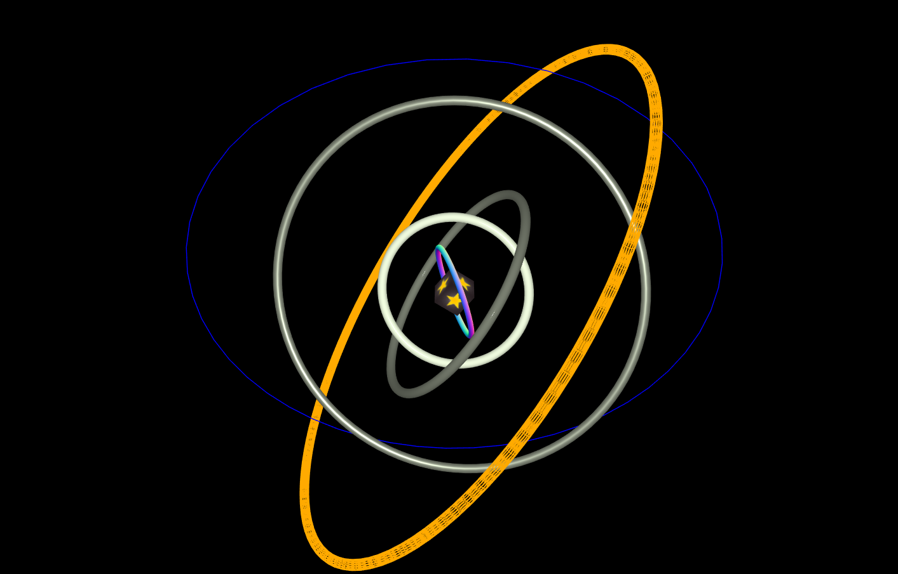
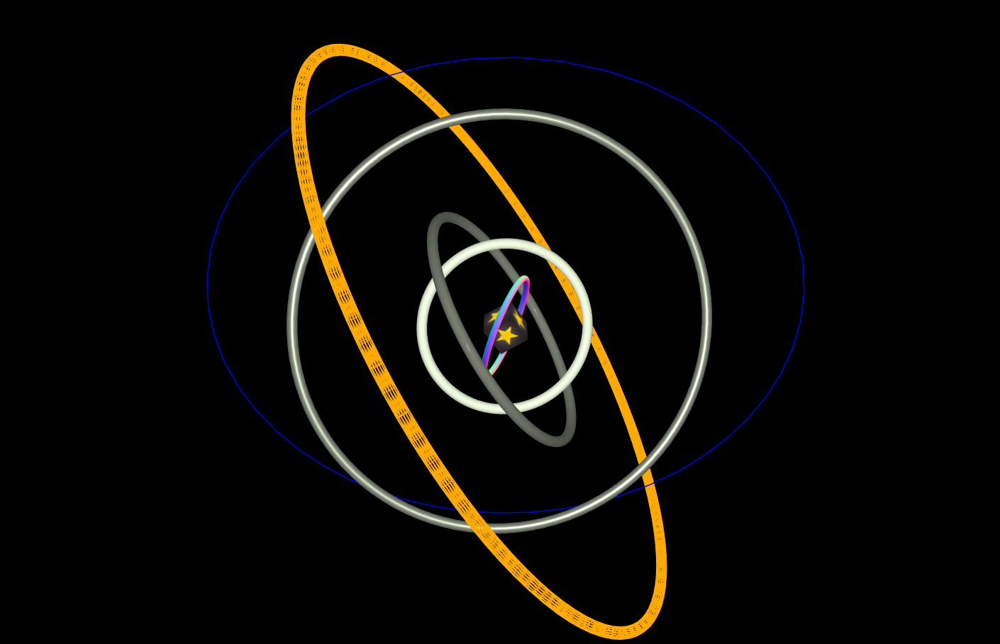
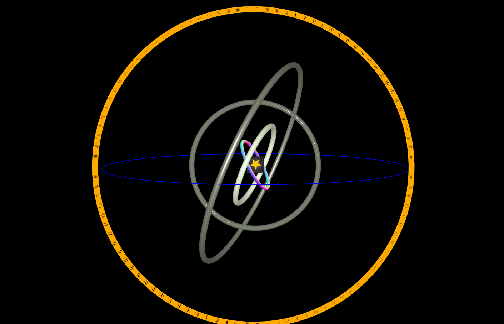

# A homework  which was completed by me.

## Introduction

The project is a homework which requires me to creat some artistic things with different materials in the scene. I created a cube and many different TorusBufferGeometries and a LineGeometry. Each of them has different material. I made all geometries rotate in the scene like a celestial body which has many orbitals.

---

## Code

#### This part explains the code used for the **index.js**

* The following code creates an empty scene, a basic perspective camera, a renderer. This renderer configures the color of background and the size of window.

```JavaScript
// -----------------------------------------------------------------------------
// BASIC SETUP
// ------------------------------------------------

// Create an empty scene --------------------------
var scene = new THREE.Scene();

// Create a basic perspective camera --------------
camera = new THREE.PerspectiveCamera(35, window.innerWidth / window.innerHeight, 300, 10000 );

// Create a renderer with Antialiasing ------------
var renderer = new THREE.WebGLRenderer({antialias:true});

// Configure renderer clear color
//renderer.setClearColor("#5A8296");
renderer.setClearColor("#000000");

// Configure renderer size
renderer.setSize( window.innerWidth, window.innerHeight );

// Append Renderer to DOM
document.body.appendChild( renderer.domElement );
```

* The following function creates light1 and light2, meanwhile it adds light1 and light2 in the scene. Secondly, the function creats one geometry and many different kinds of materials. Then the code creates meshes to combine the geometry with different materials. Finally, the code defines the position of the meshes and adds the meshes to scene.

```JavaScript
// Configure lights -------------------------------
var light1 = new THREE.AmbientLight(0xffffff, 0.5);
scene.add(light1);

var light2 = new THREE.PointLight(0xffffff, 0.5);
scene.add(light2);
// ------------------------------------------------

// Main Content

// ------------------------------------------------

// Create a TorusBufferGeometry Mesh with material ---------
var geometry1 = new THREE.TorusBufferGeometry( 50, 3, 16, 100 );
//MATERIAL 1 (non-shiny material):
var material1 = new THREE.MeshNormalMaterial();
//Mesh with material
//set position of Mesh
var mesh1 = new THREE.Mesh( geometry1, material1 );
mesh1.position.z = -1000;
mesh1.position.y = 0;

// ------------------------------------------------

// Create a TorusBufferGeometry Mesh with material ---------
var geometry2 = new THREE.TorusBufferGeometry( 80, 5, 16, 100 );
//MATERIAL 5 (shiny material):
var material5 = new THREE.MeshPhongMaterial({
  color: 0xF3FFE2,
  specular: 0xffffff,
  shininess: 1000,
  lightMap: null,
  lightMapIntensity: 1,
  bumpMap: null,
  bumpScale: 1,
  normalMap: null,
  normalScale: 1,
  displacementMap: null,
  displacementScale: 1,
  displacementBias: 0,
  specularMap: null
});
//Mesh with material
//set position of Mesh
var mesh2 = new THREE.Mesh( geometry2, material5 );
mesh2.position.z = -1000;
mesh2.position.y = 0;

// ------------------------------------------------

// Create a TorusBufferGeometry Mesh with material ---------
var geometry3 = new THREE.TorusBufferGeometry( 120, 5, 16, 100 );
//MATERIAL 7 (physical-based material)
var material7 = new THREE.MeshPhysicalMaterial({
  color: 0xF3FFE2,
  roughness: 0,
  metalness: 0.5,
  reflectivity: 0.5,
  clearCoat: 0,
  claerCoatRoughness: 0
});
//Mesh with material
//set position of Mesh
var mesh3 = new THREE.Mesh( geometry3, material7 );
mesh3.position.z = -1000;
mesh3.position.y = 0;

// ------------------------------------------------

// Create a TorusBufferGeometry Mesh with material ---------
var geometry4 = new THREE.TorusBufferGeometry( 200, 5, 16, 100 );
//MATERIAL 6 (combination of shiny + non-shinny):
var material6 = new THREE.MeshStandardMaterial({
  color: 0xF3FFE2,
  roughness: 0.5,
  metalness: 0.5
});
//Mesh with material
//set position of Mesh
var mesh4 = new THREE.Mesh( geometry4, material6 );
mesh4.position.z = -1000;
mesh4.position.y = 0;

// ------------------------------------------------

// Create a TorusBufferGeometry Mesh with material ---------
var geometry5 = new THREE.TorusBufferGeometry( 300, 5, 16, 100 );
//MATERIAL 12
var material12 =  new THREE.MeshBasicMaterial( { color: 0xffaa00, wireframe: true } );
//Mesh with material
//set position of Mesh
var mesh5 = new THREE.Mesh( geometry5, material12 );
mesh5.position.z = -1000;
mesh5.position.y = 0;

// ------------------------------------------------

// Create a Cube Mesh with material ---------
var geometry7 = new THREE.BoxGeometry( 30,30, 30 );
//MATERIAL 15
var texture = new THREE.TextureLoader().load("texture.jpg");
var material15 = new THREE.MeshBasicMaterial({map : texture});
//Mesh with material
//set position of Mesh
var mesh7 = new THREE.Mesh( geometry7, material15 );
mesh7.position.z = -1000;
mesh7.position.x = 0;
mesh7.position.y = 0;

// ------------------------------------------------

// Create a Line Mesh with material ---------
var vertices = [];
				var divisions = 50;
				for ( var i = 0; i <= divisions; i ++ ) {
					var v = ( i / divisions ) * ( Math.PI * 2 );
					var x = Math.sin( v );
					var z = Math.cos( v );
					vertices.push( x, 0, z );
				}
        //
var geometry6 = new THREE.BufferGeometry();
    geometry6.addAttribute( 'position', new THREE.Float32BufferAttribute( vertices, 3 ) );
        //
        for ( var i = 1; i <= 3; i ++ ) {
					var material3 = new THREE.LineBasicMaterial( {
						color: Math.random() * 0xffffff,
						linewidth: 10
					} );
					var line = new THREE.Line( geometry6, material3 );
					line.scale.setScalar( i / 3 );
					scene.add( line );
				}
//MATERIAL 3 (non-shiny material):
var material3 = new THREE.LineDashedMaterial( {
					color: 'blue',
					linewidth: 1,
					dashSize: 10,
					gapSize: 10
				} );
				//Line with material
				//set position of Line
				var line = new THREE.Line( geometry6, material3 );
				line.scale.setScalar( 280 );
        line.position.z = -1000;
        line.position.y = 0;
				scene.add( line );

// ------------------------------------------------

// Add mesh to scene
scene.add( mesh1 );
scene.add( mesh2 );
scene.add( mesh3 );
scene.add( mesh4 );
scene.add( mesh5 );
scene.add( mesh7 );

// ------------------------------------------------
```

* In the loop function, the code makes the meshes rotate in the loop. Finally, the renderer renders the scene.

```JavaScript
var rot = 0;

// Render Loop
var render = function () {
  requestAnimationFrame( render );

  rot += 0.01;

  mesh1.rotation.x = rot+1; //Continuously rotate the mesh
  mesh1.rotation.y = rot+1;

  mesh2.rotation.x = rot; //Continuously rotate the mesh
  mesh2.rotation.y = rot;

  mesh3.rotation.x = rot+2; //Continuously rotate the mesh
  mesh3.rotation.y = rot+2;

  mesh4.rotation.x = rot; //Continuously rotate the mesh
  mesh4.rotation.y = rot;

  mesh5.rotation.x = rot+2; //Continuously rotate the mesh
  mesh5.rotation.y = rot+2;

  line.rotation.x = rot-1; //Continuously rotate the mesh
  line.rotation.y = rot-1;

  mesh7.rotation.x = rot+2; //Continuously rotate the mesh
  mesh7.rotation.y = rot+2;

  // Render the scene
  renderer.render(scene, camera);
};
```

* Run function render

```JavaScript
render(); //Run the function render
```

#### This part explains the code used for the **index.html**

* The following code imports **three.min.js** and **index.js**. For this project, a few dependencies are needed, which can be found in the folder named **libraries**. The **three.min.js** is found in the **Library**.

```JavaScript
<!DOCTYPE html>
<html lang="en" >
  <head>
    <meta charset="UTF-8" />
    <title>Three.js</title>
      <!--  Simple reset to delete the margins  -->
      <style>
        body { margin: 0; }
        canvas { width: 100%; height: 100% }
      </style>
      <!--  Three.js CDN  -->
      <!-- <script src="https://cdnjs.cloudflare.com/ajax/libs/three.js/96/three.min.js"></script>-->
      <script src="build/three.min.js"></script>

  </head>
  <body>
    <!--  Our code  -->
    <script src="js/index.js"></script>
  </body>
</html>
  ```

---

## The final general view of code
<p align="center">



</p>
