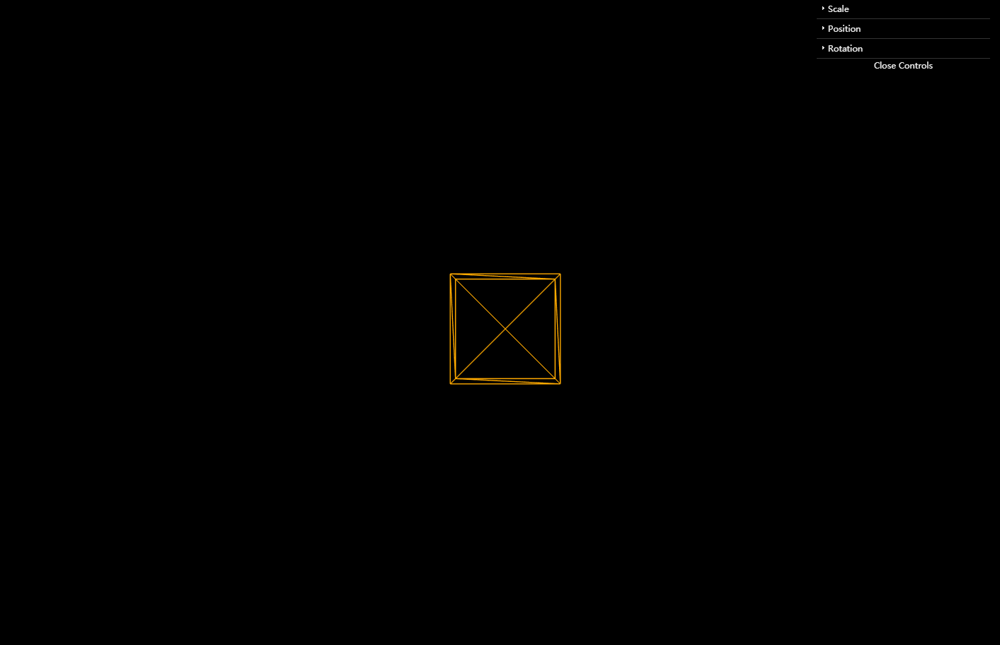
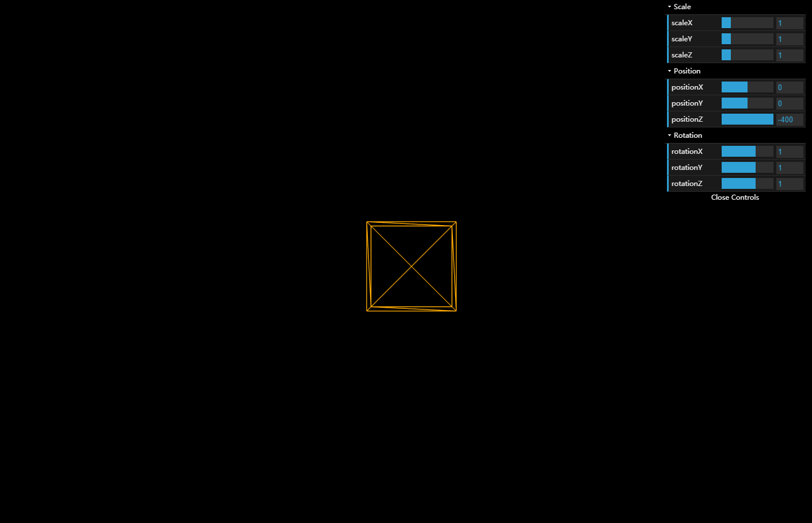
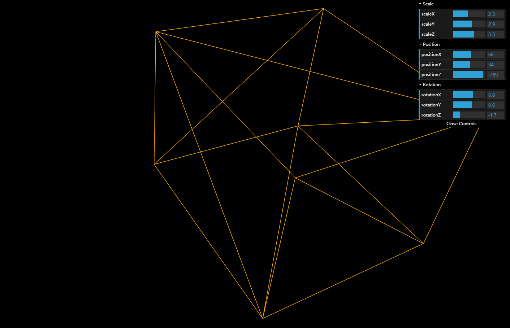

# An exercise which shows that a cube which can be controlled by adjusting data of GUI in the screen.

## Introduction

The project is an exercise which required me to creat GUI in the scene. People can control the data of the cube across the GUI. The scale and position and rotation of the cube can be controlled.

---

## Code

#### This part explains the code used for the **index.js**

* The following code defines some global variables

```JavaScript
//Global variables
var scene, camera, renderer;
var geometry, material, mesh;
```

* The following code creates an empty scene, a basic perspective camera, a renderer. This renderer configures the color of background and the size of window.

```JavaScript
// Create an empty scene --------------------------
scene = new THREE.Scene();

// Create a basic perspective camera --------------
camera = new THREE.PerspectiveCamera(35, window.innerWidth/window.innerHeight, 300, 10000 );

// Create a renderer with Antialiasing ------------
renderer = new THREE.WebGLRenderer({antialias:true});

// Configure renderer clear color
renderer.setClearColor("#000000");

// Configure renderer size
renderer.setSize( window.innerWidth, window.innerHeight );

// Append Renderer to DOM
document.body.appendChild( renderer.domElement );
```

* The following code creates a cube and basic material firstly. Then the code creates mesh to combine the cube with material. Finally, the code defines the position of the mesh and adds the mesh to scene.

```JavaScript
// Create a Cube Mesh with basic material ---------
geometry = new THREE.BoxGeometry(100, 100, 100);
material = new THREE.MeshBasicMaterial( { color: 0xffaa00, wireframe: true } );

mesh = new THREE.Mesh( geometry, material );
mesh.position.z = -1000;

// Add mesh to scene
scene.add( mesh );
```

* In the following code, it adds controller values for GUI and sets present values for controllers firstly. Secondly, it creats a GUI and defines the name of folders. Finally, it adds each controller.

```JavaScript
//Add controller values for gui
//Set present values for controllers
  var controller = new function(){
    this.scaleX = 1;
    this.scaleY = 1;
    this.scaleZ = 1;

    this.positionX = 0;
    this.positionY = 0;
    this.positionZ = -400;

    this.rotationX = 1;
    this.rotationY = 1;
    this.rotationZ = 1;
  }

  //Create a new DAT.GUI
  var gui = new dat.GUI();

//Define the folder name
  var f1 = gui.addFolder('Scale');
  var f2 = gui.addFolder('Position');
  var f3 = gui.addFolder('Rotation');

  //Add the first controller {scale x}
  f1.add(controller,'scaleX',0.1,5).onChange(function(){
    mesh.scale.x = (controller.scaleX);
  });

  //Add the first controller {scale y}
  f1.add(controller,'scaleY',0.1,5).onChange(function(){
    mesh.scale.y = (controller.scaleY);
  });

  //Add the first controller {scale z}
  f1.add(controller,'scaleZ',0.1,5).onChange(function(){
    mesh.scale.z = (controller.scaleZ);
  });

  //Add the Second controller {position x}
  f2.add(controller,'positionX',-500,500).onChange(function(){
    mesh.position.x = (controller.positionX);
  });


  //Add the Second controller {position y}
  f2.add(controller,'positionY',-500,500).onChange(function(){
    mesh.position.y = (controller.positionY);
  });

  //Add the Second controller {position z}
  f2.add(controller,'positionZ',-5000,-400).onChange(function(){
    mesh.position.z = (controller.positionZ);
  });

  //Add the Third controller {rotation x}
  f3.add(controller,'rotationX',-3.14,3.14).onChange(function(){
    mesh.rotation.x = (controller.rotationX);
  });

  //Add the Third controller {rotation y}
  f3.add(controller,'rotationY',-3.14,3.14).onChange(function(){
    mesh.rotation.y = (controller.rotationY);
  });

  //Add the Third controller {rotation z}
  f3.add(controller,'rotationZ',-3.14,3.14).onChange(function(){
    mesh.rotation.z = (controller.rotationZ);
  });
}
```

* In the loop function, the code renders each thing.

```JavaScript
// Render Loop
var render = function () {
  requestAnimationFrame( render );

  renderer.setClearColor("#000000");

  // Render the scene
  renderer.render(scene, camera);
};
```

* Run function render

```JavaScript
init();
render();
```

#### This part explains the code used for the **index.html**

* The following code imports **three.js** and **index.js** and **dat.gui.min.js**. For this project, a few dependencies are needed, which can be found in the folder named **libraries**. The **three.js** and **dat.gui.min.js** are found in the **Library**.

```JavaScript
<!DOCTYPE html>
<html lang="en">
  <head>
    <meta charset="UTF-8" />
    <title>Three.js</title>
      <style>
         body { margin:0;}
         canvas { width: 100%; height: 100%}
       </style>
     <script src="build/three.js"></script>
     <script src="js/dat.gui.min.js"></script>
   </head>
   <body>
     <script src="js/index.js"></script>

   </body>
  </html>
  ```

---

## The final general view of code
  <p align="center">
  
  
  
  </p>
