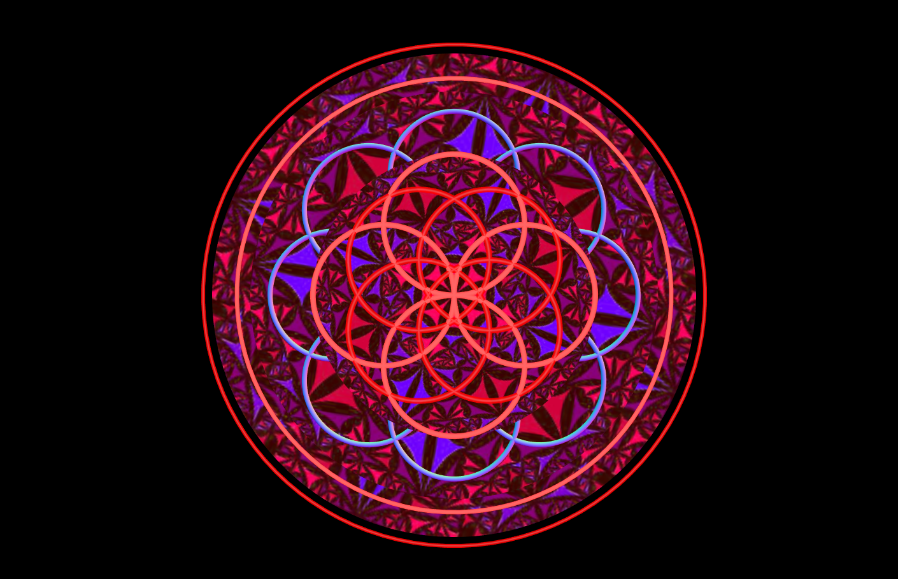

# A homework which shows that CircleBufferGeometry and TorusGeometry with different material in the screen.

## Introduction

The project is a homework which required me to creat some artistic things in the scene. The inspiration of the project is colourful glasses in the church. I created three CircleBufferGeometries and a lot of TorusGeometries and set them to different positions to make them look artistic. I also made each CircleBufferGeometry rotate in different direction meanwhile I made each TorusGeometry be motionless, which made the project's layers be luxuriant.

---

## Code

#### This part explains the code used for the **index.js**

* The following code creates an empty scene, a basic perspective camera, a renderer. This renderer configures the color of background and the size of window.

```JavaScript
// Create an empty scene --------------------------
var scene = new THREE.Scene();

// Create a basic perspective camera --------------
camera = new THREE.PerspectiveCamera(35, window.innerWidth / window.innerHeight, 300, 10000 );

// Create a renderer with Antialiasing ------------
var renderer = new THREE.WebGLRenderer({antialias:true});

// Configure renderer clear color
renderer.setClearColor("#000000");

// Configure renderer size
renderer.setSize( window.innerWidth, window.innerHeight );

// Append Renderer to DOM
document.body.appendChild( renderer.domElement );
```

* The following code creates CircleBufferGeometry and TorusGeometry firstly. Then the code creates some different materials. Then the code creats meshes to combine the geometries with materials. Finally, the code defines the positions of the meshes and adds the meshes to scene.

```JavaScript
// Configure lights -------------------------------
var light1 = new THREE.AmbientLight(0xffffff, 0.5);
scene.add(light1);

var light2 = new THREE.PointLight(0xffffff, 0.5);
scene.add(light2);
// ------------------------------------------------

// -----------------------------------------------------------------------------

// ------------------------------------------------
// Main Content
// ------------------------------------------------

// Create a Cube Mesh with basic material ---------
var geometry1 = new THREE.CircleBufferGeometry( 150, 320 );
var geometry2 = new THREE.CircleBufferGeometry( 260, 420 );
var geometry3 = new THREE.CircleBufferGeometry( 360, 520 );
var geometry4 = new THREE.TorusGeometry( 75, 3, 20, 100 );
var geometry5 = new THREE.TorusGeometry( 300, 3, 20, 100 );
var geometry6 = new THREE.TorusGeometry( 400, 3, 20, 100 );

// MATERIAL 1:
var material1 = new THREE.MeshNormalMaterial();

//MATERIAL 2:
var texture = new THREE.TextureLoader().load("texture.jpg");
var material2 = new THREE.MeshBasicMaterial({map : texture});

//MATERIAL 3:
var material3 = new THREE.MeshNormalMaterial();

//MATERIAL 4
material4 = new THREE.MeshLambertMaterial( { color: 0x666666, emissive: 0xff0000 } );

//MATERIAL 5
var material5 =  new THREE.MeshPhongMaterial( { color: 0x000000, specular: 0x666666, emissive: 0xff0000, shininess: 10, opacity: 0.9, transparent: true } );

//Mesh with material
//set position of Mesh
var mesh1 = new THREE.Mesh( geometry1, material2 );
mesh1.position.z = -1000;
mesh1.position.x = 0;
mesh1.position.y = 0;

var mesh2 = new THREE.Mesh( geometry2, material2 );
mesh2.position.z = -1200;
mesh2.position.x = 0;
mesh2.position.y = 0;

var mesh3 = new THREE.Mesh( geometry3, material2 );
mesh3.position.z = -1400;
mesh3.position.x = 0;
mesh3.position.y = 0;

var mesh4 = new THREE.Mesh( geometry4, material4 );
mesh4.position.z = -1000;
mesh4.position.x = 0;
mesh4.position.y = 75;

var mesh5 = new THREE.Mesh( geometry4, material4 );
mesh5.position.z = -1000;
mesh5.position.x = 0;
mesh5.position.y = -75;

var mesh6 = new THREE.Mesh( geometry4, material4 );
mesh6.position.z = -1000;
mesh6.position.x = 75;
mesh6.position.y = 0;

var mesh7 = new THREE.Mesh( geometry4, material4 );
mesh7.position.z = -1000;
mesh7.position.x = -75;
mesh7.position.y = 0;

var mesh8 = new THREE.Mesh( geometry4, material5 );
mesh8.position.z = -1000;
mesh8.position.x = -37.5;
mesh8.position.y = 37.5;

var mesh9 = new THREE.Mesh( geometry4, material5 );
mesh9.position.z = -1000;
mesh9.position.x = -37.5;
mesh9.position.y = -37.5;

var mesh10 = new THREE.Mesh( geometry4, material5 );
mesh10.position.z = -1000;
mesh10.position.x = 37.5;
mesh10.position.y = 37.5;

var mesh11 = new THREE.Mesh( geometry4, material5 );
mesh11.position.z = -1000;
mesh11.position.x = 37.5;
mesh11.position.y = -37.5;

var mesh12 = new THREE.Mesh( geometry4, material3 );
mesh12.position.z = -1100;
mesh12.position.x = 100;
mesh12.position.y = 100;

var mesh13 = new THREE.Mesh( geometry4, material3 );
mesh13.position.z = -1100;
mesh13.position.x = 140;
mesh13.position.y = 0;

var mesh14 = new THREE.Mesh( geometry4, material3 );
mesh14.position.z = -1100;
mesh14.position.x = 100;
mesh14.position.y = -100;

var mesh15 = new THREE.Mesh( geometry4, material3 );
mesh15.position.z = -1100;
mesh15.position.x = 0;
mesh15.position.y = -140;

var mesh16 = new THREE.Mesh( geometry4, material3 );
mesh16.position.z = -1100;
mesh16.position.x = -100;
mesh16.position.y = -100;

var mesh17 = new THREE.Mesh( geometry4, material3 );
mesh17.position.z = -1100;
mesh17.position.x = -140;
mesh17.position.y = 0;

var mesh18 = new THREE.Mesh( geometry4, material3 );
mesh18.position.z = -1100;
mesh18.position.x = -100;
mesh18.position.y = 100;

var mesh19 = new THREE.Mesh( geometry4, material3 );
mesh19.position.z = -1100;
mesh19.position.x = 0;
mesh19.position.y = 140;

var mesh20 = new THREE.Mesh( geometry5, material4 );
mesh20.position.z = -1300;
mesh20.position.x = 0;
mesh20.position.y = 0;

var mesh21 = new THREE.Mesh( geometry6, material5 );
mesh21.position.z = -1500;
mesh21.position.x = 0;
mesh21.position.y = 0;
// ------------------------------------------------

// Add mesh to scene
scene.add( mesh1 );
scene.add( mesh2 );
scene.add( mesh3 );
scene.add( mesh4 );
scene.add( mesh5 );
scene.add( mesh6 );
scene.add( mesh7 );
scene.add( mesh8 );
scene.add( mesh9 );
scene.add( mesh10 );
scene.add( mesh11 );
scene.add( mesh12 );
scene.add( mesh13 );
scene.add( mesh14 );
scene.add( mesh15 );
scene.add( mesh16 );
scene.add( mesh17 );
scene.add( mesh18 );
scene.add( mesh19 );
scene.add( mesh20 );
scene.add( mesh21 );
```

* In the loop function, the code gives each mesh a rotation and renders each thing.

```JavaScript
var rot = 0;

// Render Loop
var render = function () {
  requestAnimationFrame( render );

  rot += 0.01;

  //Continuously rotate the mesh
  mesh1.rotation.z = rot+1;

  //Continuously rotate the mesh
  mesh2.rotation.z = -rot;

  //Continuously rotate the mesh
  mesh3.rotation.z = rot+1;

  //Continuously rotate the mesh
  mesh4.rotation.z = rot+1;

  //Continuously rotate the mesh
  mesh5.rotation.z = rot+1;

  //Continuously rotate the mesh
  mesh6.rotation.z = rot+1;

  //Continuously rotate the mesh
  mesh7.rotation.z = rot+1;

  //Continuously rotate the mesh
  mesh8.rotation.z = rot+1;

  //Continuously rotate the mesh
  mesh9.rotation.z = rot+1;

  //Continuously rotate the mesh
  mesh10.rotation.z = rot+1;

  //Continuously rotate the mesh
  mesh11.rotation.z = rot+1;

  //Continuously rotate the mesh
  mesh12.rotation.z = rot+1;

  //Continuously rotate the mesh
  mesh13.rotation.z = rot+1;

  //Continuously rotate the mesh
  mesh14.rotation.z = rot+1;

  //Continuously rotate the mesh
  mesh15.rotation.z = rot+1;

  //Continuously rotate the mesh
  mesh16.rotation.z = rot+1;

  //Continuously rotate the mesh
  mesh17.rotation.z = rot+1;

  //Continuously rotate the mesh
  mesh18.rotation.z = rot+1;

  //Continuously rotate the mesh
  mesh19.rotation.z = rot+1;

  //Continuously rotate the mesh
  mesh20.rotation.z = rot+1;

  //Continuously rotate the mesh
  mesh21.rotation.z = rot+1;

  // Render the scene
  renderer.render(scene, camera);
};
```

* Run function render

```JavaScript
render(); //Run the function render
```

#### This part explains the code used for the **index.html**

* The following code imports **three.min.js** and **index.js**. For this project, a few dependencies are needed, which can be found in the folder named **libraries**. The **three.min.js** is found in the **Library**.

```JavaScript
<!DOCTYPE html>
<html lang="en" >
  <head>
    <meta charset="UTF-8" />
    <title>Three.js</title>
      <!--  Simple reset to delete the margins  -->
      <style>
        body { margin: 0; }
        canvas { width: 100%; height: 100% }
      </style>
      <!--  Three.js CDN  -->
      <!-- <script src="https://cdnjs.cloudflare.com/ajax/libs/three.js/96/three.min.js"></script>-->
      <script src="build/three.min.js"></script>
  </head>
  <body>
    <!--  Our code  -->
    <script src="js/index.js"></script>
  </body>
</html>
  ```

---

## The final general view of code
  <p align="center">
  
  </p>
