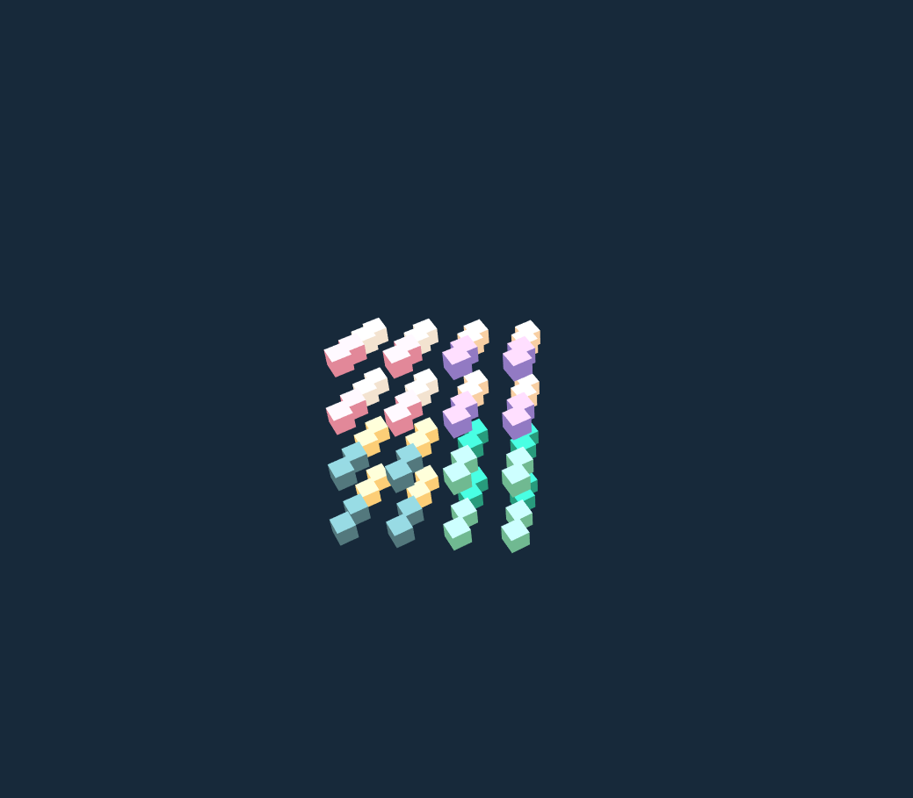
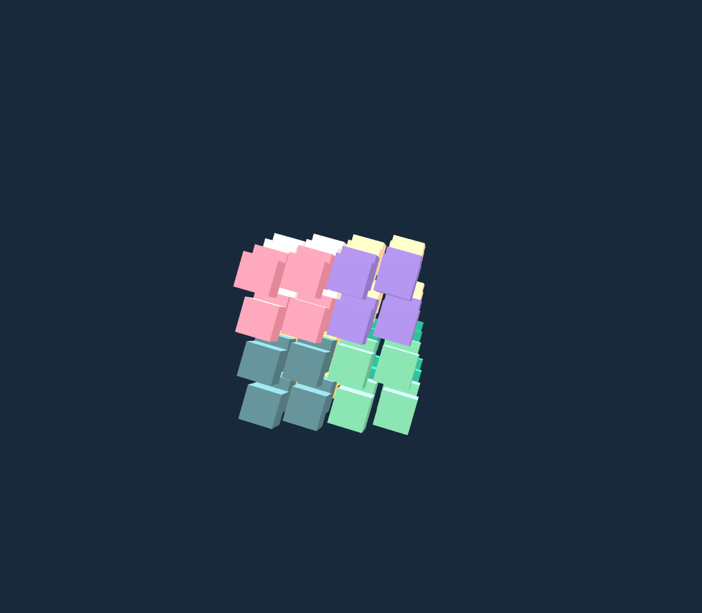
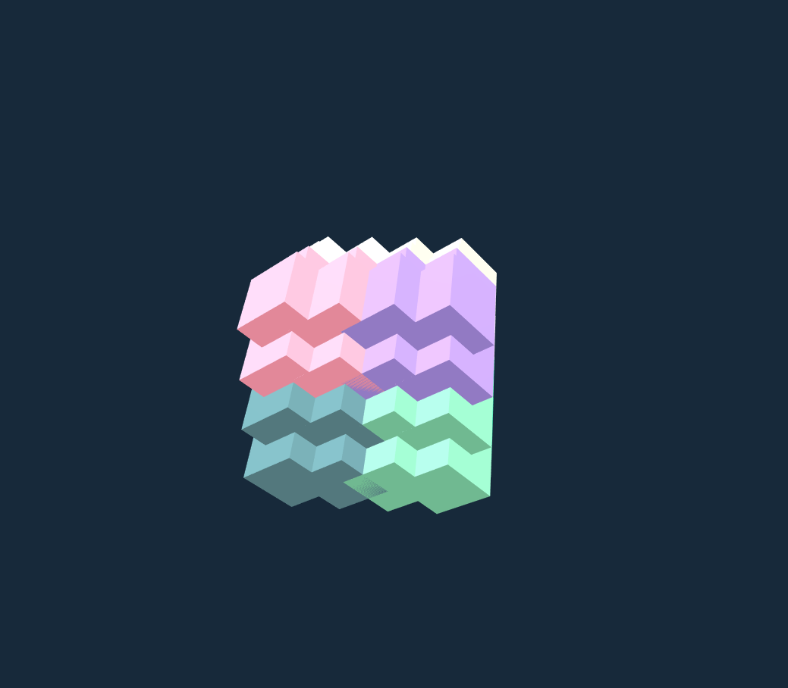
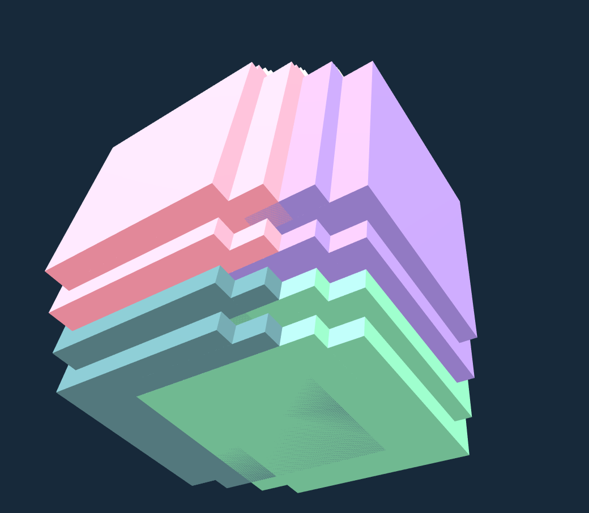

# An exercise which shows that many cubes rotate in the same rotation and speed in the screen.

## Introduction

The project is an exercise which required me to creat a three dimensional grid of objects, and position them accordingly in the scene. Then the exercise also required me to make every adjacent eight objects to be one kind of color and make each object rotate in the scene. The difference in this time, each object not only rotates in the same direction and speed, but also becomes bigger and bigger all the time.

---

## Code

#### This part explains the code used for the **index.js**

* The following code defines some global variables

```JavaScript
var renderer, scene, camera;
var controls;
var cubes = [];
var rot = 0;
```

* The following code creates an empty scene, a perspective camera, a spotLight, a ambLight, a renderer. This renderer configures the color of background and the size of window. The code also creats **controls** to make people could rotate their view by themselves.

```JavaScript
scene = new THREE.Scene();

var W = window.innerWidth,
    H = window.innerHeight;

camera = new THREE.PerspectiveCamera(45, W / H, .1, 1000);
camera.position.set(10, 20, 85);//could change the camera's rotations
camera.lookAt(scene.position);

var spotLight = new THREE.SpotLight(0xFFFFFF);
spotLight.position.set(0, 500, 0);
scene.add(spotLight);
//spotLight.castShadow = true;

var ambLight = new THREE.AmbientLight(0xFFFFFF);
ambLight.position.set(0, 500, 0);
ambLight.add(spotLight);
scene.add(ambLight);

renderer = new THREE.WebGLRenderer({antialias:true});
renderer.setClearColor(0x17293a);
renderer.setSize(W, H);
//renderer.shadowMapEnabled = true;

controls = new THREE.OrbitControls(camera, renderer.domElement); //could rotate the view
```

* The following code creates a three dimensional grid of objects, and position them accordingly in the scene firstly. Secondly, the code makes every adjacent eight objects to be one kind of color. Thirdly, the code creates mesh to combine the objects with materials. Finally, the code defines the position and scale of the mesh and adds the mesh to scene, meanwhile the code pushes mesh to **cubes**.

```JavaScript
//Create a three dimensional grid of objects, and position them accordingly
  for (var x = -10; x < 10; x += 5 ) {// Start from -10 and sequentially add one every 5 pixels
    for (var y = -10; y < 10; y += 5) {
      for (var z = -10; z < 10; z += 5) {
      var boxGeometry = new THREE.BoxGeometry(3, 3, 3);

      //Concatenation of the x and y and z values (open Console to see)
      console.log("X:" +x+ ", Y: " +y+ ", Z: " +z);

      //The color of the material is assigned a motionless color
      //The material in different field is assigned different color.
      if ( x >= 0 && y >= 0 && z >=0 ){
      var boxMaterial = new THREE.MeshLambertMaterial({color: 0x927AC3});
    } // 1 ture  & color
      if ( x < 0 && y >= 0 && z >= 0 ){
      var boxMaterial = new THREE.MeshLambertMaterial({color: 0xE28899});
    } //2 ture & color
      if ( x >= 0 && y >= 0 && z < 0 ){
      var boxMaterial = new THREE.MeshLambertMaterial({color: 0xF8CFA3});
    } //3 ture & color
      if ( x < 0 && y >= 0 && z < 0 ){
      var boxMaterial = new THREE.MeshLambertMaterial({color: 0xF3E3D0});
    } //4 ture & color
      if ( x >= 0 && y < 0 && z >= 0 ){
      var boxMaterial = new THREE.MeshLambertMaterial({color: 0x70B991});
    } //5 ture & color
      if ( x < 0 && y < 0 && z >= 0 ){
      var boxMaterial = new THREE.MeshLambertMaterial({color: 0x53787D});
    }//6 ture & color
      if ( x < 0 && y < 0 && z < 0 ){
      var boxMaterial = new THREE.MeshLambertMaterial({color: 0xFCCE77});
    } //7 ture & color
      if ( x >= 0 && y < 0 && z < 0 ){
      var boxMaterial = new THREE.MeshLambertMaterial({color: 0x289B7C});
    }//8 ture & color

      var mesh = new THREE.Mesh(boxGeometry, boxMaterial);
      //mesh.castShadow = true;
      mesh.position.x = x; //set the mesh
      mesh.position.z = z; //set the mesh
      mesh.position.y = y; //set the mesh
      mesh.scale.y = 1; //can change the scale of mesh in y direction

      //add mesh in the scene
      scene.add(mesh);
      //push mesh in the cubes
      cubes.push(mesh);
  }
}
}

  console.log(cubes);

  document.body.appendChild(renderer.domElement);
```

* In the loop function, the code makes each object rotate in the same direction and speed. Meanwhile, the code makes each object become bigger and bigger all the time.

```JavaScript
// Render Loop
function drawFrame(){
  requestAnimationFrame(drawFrame);

  rot += 0.01;

  //forEach takes all the arrary entries and passes the c as the ...
  cubes.forEach(function(c, i){
  c.rotation.x = rot; //Roate the object
  c.rotation.y = rot; //Roate the object
  c.scale.x = rot; //make the scale in x direction to be bigger
  c.scale.y = rot; //make the scale in y direction to be bigger
  c.scale.z = rot; //make the scale in z direction to be bigger
  });

  renderer.render(scene, camera);
}
```

* Run function render

```JavaScript
init();
drawFrame();
```

#### This part explains the code used for the **index.html**

* The following code imports **three.min.js** and **index.js** and **OrbitControls.js**. For this project, a few dependencies are needed, which can be found in the folder named **libraries**. The **three.min.js** and **OrbitControls.js** are found in the **Library**.

```JavaScript
<!DOCTYPE html>
<html lang="en" >
  <head>
    <meta charset="UTF-8" />
    <title>Three.js</title>
      <!--  Simple reset to delete the margins  -->
      <style>
        body { margin: 0; }
        canvas { width: 100%; height: 100% }
      </style>
      <!--  Three.js CDN  -->
      <!-- <script src="https://cdnjs.cloudflare.com/ajax/libs/three.js/96/three.min.js"></script>-->
      <script src="build/three.min.js"></script>
      <script src="js/OrbitControls.js"></script>
  </head>
  <body>
    <!--  Our code  -->
    <script src="js/index.js"></script>
  </body>
</html>
  ```

---

## The final general view of code
  <p align="center">
  
  
  
  
  </p>
