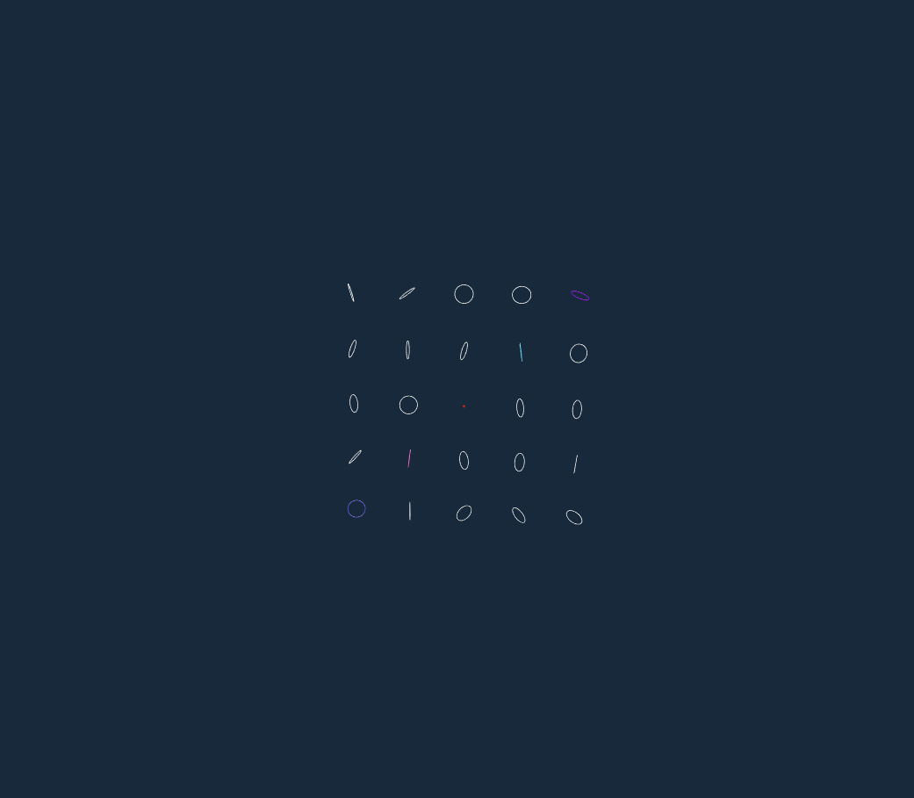
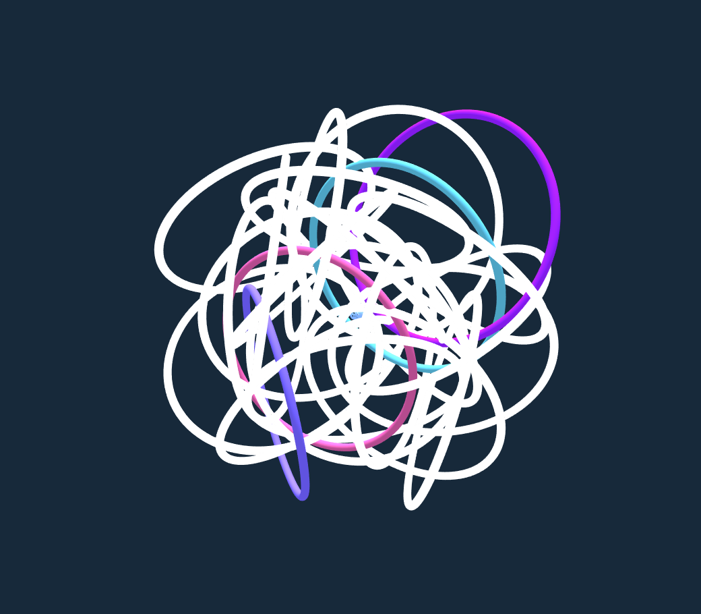
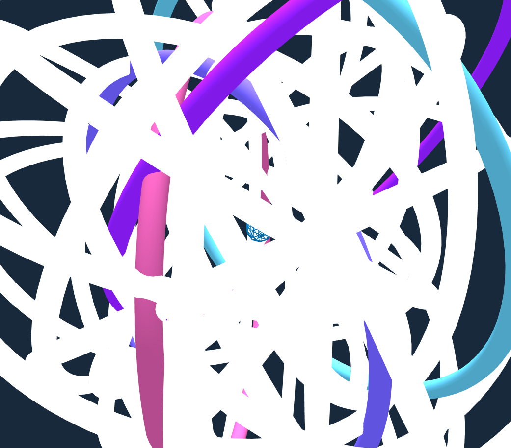
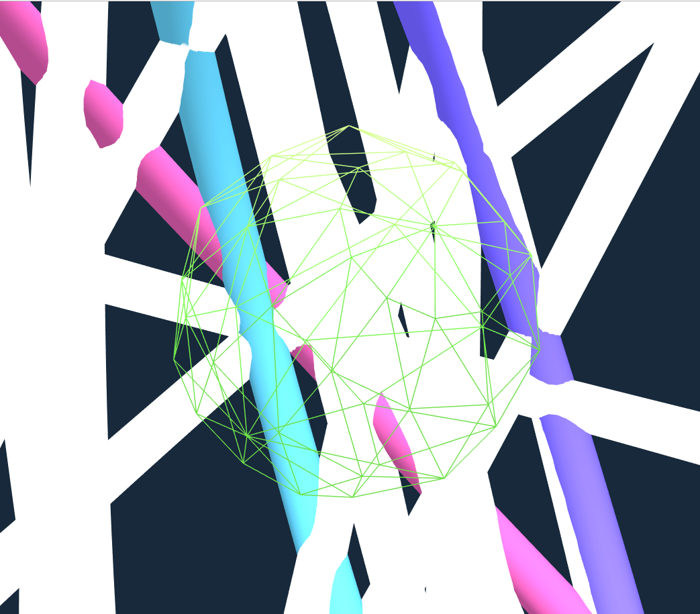

# An exercise which shows that many TorusBufferGeometries and a SphereGeometry rotate and become bigger or smaller in the screen.

## Introduction

The project is an exercise which required me to creat a two dimensional grid of objects, and position them accordingly in the scene. Then the exercise also required me to make the special objects be in random color and specified shape, meanwhile other objects were required to be white. The difference in this project is that each object's scale was required to become bigger still to the limit and then become to the original scale.

---

## Code

#### This part explains the code used for the **index.js**

* The following code defines some global variables

```JavaScript
var renderer, scene, camera;
var controls;
var cubes = [];
var randomRotationX = [];
var randomRotationY = [];
```

* The following code creates an empty scene, a perspective camera, a spotLight, a ambLight, a renderer. This renderer configures the color of background and the size of window. The code also creats **controls** to make people could rotate their view by themselves.

```JavaScript
console.log("Init Function Starts");

scene = new THREE.Scene();

var W = window.innerWidth,
    H = window.innerHeight;

camera = new THREE.PerspectiveCamera(45, W / H, .1, 1000);
camera.position.set(10, 20, 85);//could change the camera's rotations
camera.lookAt(scene.position);

var spotLight = new THREE.SpotLight(0xFFFFFF);
spotLight.position.set(0, 500, 0);
scene.add(spotLight);
//spotLight.castShadow = true;

var ambLight = new THREE.AmbientLight(0xFFFFFF);
ambLight.position.set(0, 500, 0);
ambLight.add(spotLight);
scene.add(ambLight);

renderer = new THREE.WebGLRenderer({antialias:true});
renderer.setClearColor(0x17293a);
renderer.setSize(W, H);
//renderer.shadowMapEnabled = true;

controls = new THREE.OrbitControls(camera, renderer.domElement); //could rotate the view
```

* The following code creates a two dimensional grid of objects, and position them accordingly in the scene firstly. Secondly, the code creats a material with random  color. Thirdly, the code gives random color to the special objects in special position, meanwhile others were white. Fourthly, the code creates mesh to combine the objects with materials, and then it defines the position and random rotation of mesh. Fifthly, the code sets randomValueX and randomValueY, meanwhile it pushes randomValueX in **randomRotationX** and pushes randomValueY in **randomRotationY**. Finally, the code adds the mesh to scene and pushes mesh to **cubes**.

```JavaScript
//Create a two dimensional grid of objects, and position them accordingly
for (var x = -10; x <= 10; x += 5 ) {// Start from -10 and sequentially add one every 5 pixels
  for (var y = -10; y <= 10; y += 5) {
    var boxGeometry = new THREE.TorusBufferGeometry( 80, 3, 20, 100 );

    //Concatenation of the x and y values (open Console to see)
    console.log("X:" +x+ ", Y: " +y);

//The color of the material is assigned a random color
var boxMaterial = new THREE.MeshLambertMaterial({color:  0xFFFFFF});

//give random color to the special position
if (x==-5 && y==-5){
  boxMaterial = new THREE.MeshLambertMaterial({color: Math.random() * 0xFFFFFF});
} else if (x==5 && y==5){
  boxMaterial = new THREE.MeshLambertMaterial({color: Math.random() * 0xFFFFFF});
} else if (x==-10 && y==-10){
  boxMaterial = new THREE.MeshLambertMaterial({color: Math.random() * 0xFFFFFF});
}
else if (x==0 && y==0){
  boxMaterial = new THREE.MeshLambertMaterial({color: Math.random() * 0xFFFFFF});
}
else if (x==10 && y==10){
  boxMaterial = new THREE.MeshLambertMaterial({color: Math.random() * 0xFFFFFF});
}
else {
  boxMaterial = new THREE.MeshLambertMaterial({color:  0xFFFFFF});
}

              //The each cube's rotation is random
    					var mesh = new THREE.Mesh(boxGeometry, boxMaterial);

    						mesh.position.x = x; //set the mesh
    						mesh.position.y = y; //set the mesh
                mesh.scale.y = 0.5;  //set the scale of mesh

    						mesh.rotation.x = Math.random() * 2 * Math.PI; //The rotation of x is random
                mesh.rotation.y = Math.random() * 2 * Math.PI; //The rotation of y is random
                mesh.rotation.z = Math.random() * 2 * Math.PI; //The rotation of z is random

             var randomValueX = (Math.random() * 0.01) - 0.05; //set a appropriate randomValueX
             var randomValueY = (Math.random() * 0.01) - 0.05; //set a appropriate randomValueY
             randomRotationX.push(randomValueX); //push randomValueX into randomRotationX
             randomRotationY.push(randomValueY); //push randomValueY into randomRotationY

                //add mesh in the scene
    						scene.add( mesh );
                //push mesh in the cubes
                cubes.push(mesh);

}
}
```

* In the loop function, it defines scale of object and makes all objects' scale start from -5 and sequentially plus 0.01 every time. When the scale > 3, the scale turns to the original scale. Meanwhile, the function gives special objects special shape and material and renders each thing.

```JavaScript
//define scaleCube1, scaleCube2, scaleCube3
var scaleCube1 = -5;
var scaleCube2 = -5;
var scaleCube3 = -5;

//render loop
function drawFrame(){
  requestAnimationFrame(drawFrame);

scaleCube1 += 0.01; // Start from -5 and sequentially plus 0.01 every time
if (scaleCube1 > 3) scaleCube1 = -5;

scaleCube2 += 0.01; // Start from -5 and sequentially plus 0.01 every time
if (scaleCube2 > 3) scaleCube2 = -5;

scaleCube3 += 0.01; // Start from -5 and sequentially plus 0.01 every time
if (scaleCube3 > 3) scaleCube3 = -5;

  //forEach takes all the arrary entries and passes the c as the ...
  cubes.forEach(function(c, i){

    c.rotation.x += randomRotationX[i]; //Roate the object
    c.rotation.y += randomRotationY[i]; //Roate the object

    //creat a specified geometry and material
    cubes[12].geometry = new THREE.SphereGeometry( 5, 10, 5 );
    cubes[12].material = new THREE.MeshLambertMaterial({color: Math.random() * 0xFFFFFF, wireframe:true});

    c.scale.x = scaleCube1; //give each object scale data
    c.scale.y = scaleCube2; //give each object scale data
    c.scale.z = scaleCube3; //give each object scale data

});

//open Console to see
console.log(scaleCube1)
console.log(scaleCube2)
console.log(scaleCube3)

  renderer.render(scene, camera);
}
```

* Run function render

```JavaScript
init();
drawFrame();
```

#### This part explains the code used for the **index.html**

* The following code imports **three.min.js** and **index.js** and **OrbitControls.js**. For this project, a few dependencies are needed, which can be found in the folder named **libraries**. The **three.min.js** and **OrbitControls.js** are found in the **Library**.

```JavaScript
<!DOCTYPE html>
<html lang="en" >
  <head>
    <meta charset="UTF-8" />
    <title>Three.js</title>
      <!--  Simple reset to delete the margins  -->
      <style>
        body { margin: 0; }
        canvas { width: 100%; height: 100% }
      </style>
      <!--  Three.js CDN  -->
      <!-- <script src="https://cdnjs.cloudflare.com/ajax/libs/three.js/96/three.min.js"></script>-->
      <script src="build/three.min.js"></script>
      <script src="js/OrbitControls.js"></script>

  </head>
  <body>
    <!--  Our code  -->
    <script src="js/index.js"></script>
  </body>
</html>
  ```

---

## The final general view of code
  <p align="center">
  
  
  
  
  </p>
