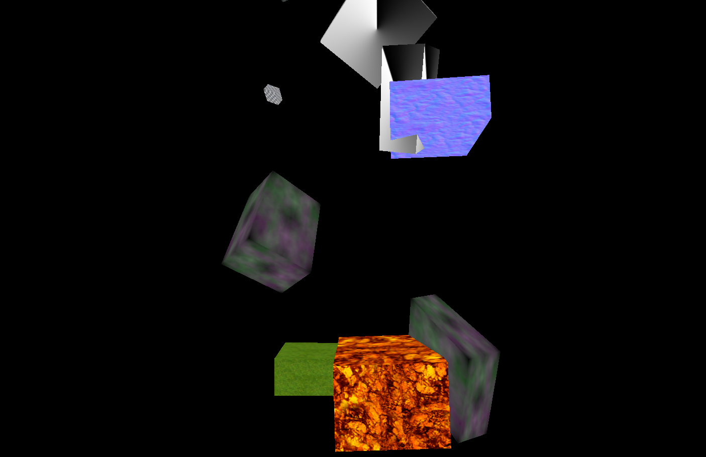
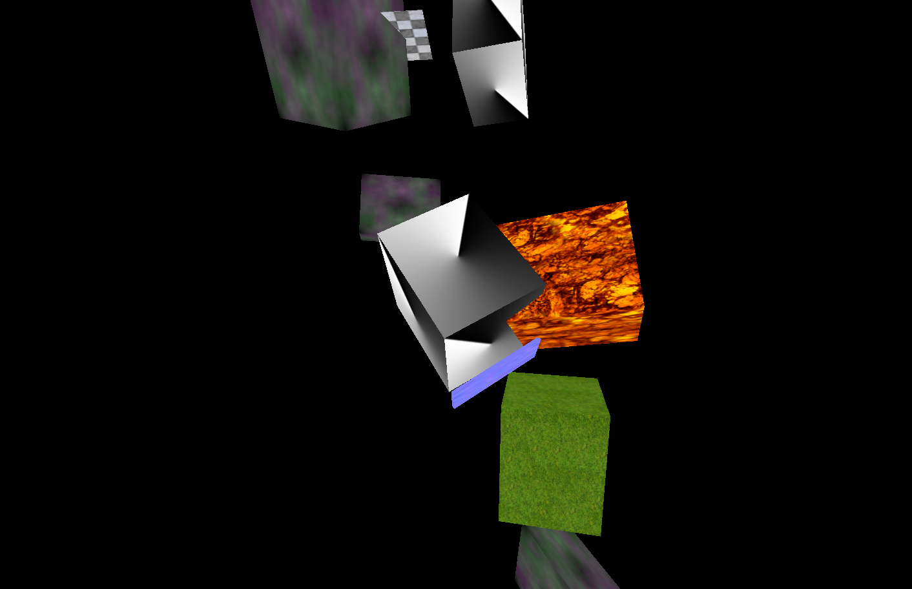

# An exercise which shows that many cubes with random material drop randomly from the top of the screen.

## Introduction

The project is an exercise which required me to creat many cubes with random material and make them drop randomly from the top of the screen. Meanwhile, the exercise required me to make all cubes' scale and speed be random too.

---

## Code

#### This part explains the code used for the **index.js**

* The following code defines some global variables

```JavaScript
//Setup the global variables
var camera, scene, renderer, geometry, material, mesh;
var texture;
var cubesNum = 10;
var cubes = [];
var speed = [];
```

* The following code creatsa new scene, a camera, a renderer, a renderer.

```JavaScript
// Create a scene
scene = new THREE.Scene();

// Create a camera
// 	Set a Field of View (FOV) of 75 degrees
// 	Set an Apsect Ratio of the inner width divided by the inner height of the window
//	Set the 'Near' distance at which the camera will start rendering scene objects to 2
//	Set the 'Far' (draw distance) at which objects will not be rendered to 1000
camera = new THREE.PerspectiveCamera( 75, window.innerWidth / window.innerHeight, 2, 1000 );
// Move the camera 'out' by 30
camera.position.z = 30;

// Create a WebGL Rendered
renderer = new THREE.WebGLRenderer();
// Set the size of the rendered to the inner width and inner height of the window
renderer.setSize( window.innerWidth, window.innerHeight );

// Add in the created DOM element to the body of the document
document.body.appendChild( renderer.domElement );
```

* The following code creates a BoxGeometry firstly. Secondly, the code gives cubes random speed. Thirdly, the code creates material to load random textures. Fourthly, the code creats mesh to combine the floor with material, then it defines random position and scale of mesh. Finally, the code adds mesh to scene and push mesh to **cubes**.

```JavaScript
// Create a geometry
// 	Create a box (cube) of 10 width, length, and height
geometry = new THREE.BoxGeometry( 10, 10, 10 );

for (var i = 0; i<cubesNum; i ++){
  var randomValue = Math.random() * 0.5;
  speed.push(randomValue);

// Load random texture
texture = new THREE.TextureLoader().load("textures/texture" + Math.floor(Math.random()*10) + ".jpg");

// Create a MeshBasicMaterial with a loaded texture
material = new THREE.MeshBasicMaterial( { map: texture} );

// Combine the geometry and material into a mesh
mesh = new THREE.Mesh( geometry, material );

//random position
mesh.position.y = (Math.random()*30) - 15;
mesh.position.x = (Math.random()*30) - 15;

//random scale
mesh.scale.x = Math.random();
mesh.scale.y = Math.random();
mesh.scale.z = Math.random();

// Add the mesh to the scene
scene.add( mesh );
cubes.push( mesh );
}
```

* In the following function, it gives cubes random speed and makes cubes drop randomly from the screen. Meanwhile, the code renders everything.

```JavaScript
function animate() {
	// Call the requestAnimationFrame function on the animate function
	// 	(thus creating an infinite loop)
	requestAnimationFrame( animate );

	for (var i = 0; i<cubesNum; i ++){
		// Rotate the x position of the mesh by 0.03
		cubes[i].rotation.x += speed[i]/50;
		// Rotate the y position of the mesh by 0.02
		cubes[i].rotation.y += speed[i]/50;

		//Move the mesh towards the bottom of the screen
		cubes[i].position.y -= speed[i];

		//If the mesh passes the bottom of the screen,
		//make it appear on the top. Also x position is randomized
		if (cubes[i].position.y <- 30){
			cubes[i].position.y = 35;
			cubes[i].position.x = (Math.random() * -20) +10;
      //cubes[i].scale.x = Math.random();
			//cubes[i].scale.y = Math.random();
			//cubes[i].scale.z = Math.random();

	}

	}

	// Render everything using the created renderer, scene, and camera
	renderer.render( scene, camera );
}
}
```

* Run function render

```JavaScript
init();
animate();
```

#### This part explains the code used for the **index.html**

* The following code imports **three.min.js** and **index.js**. For this project, a few dependencies are needed, which can be found in the folder named **libraries**. The **three.min.js** are found in the **Library**.

```JavaScript
<!DOCTYPE html>
<html lang="en" >
  <head>
    <meta charset="UTF-8" />
    <title>Three.js</title>
      <!--  Simple reset to delete the margins  -->
      <style>
        body { margin: 0; }
        canvas { width: 100%; height: 100% }
      </style>
      <!--  Three.js CDN  -->
      <!-- <script src="https://cdnjs.cloudflare.com/ajax/libs/three.js/96/three.min.js"></script>-->
      <script src="build/three.min.js"></script>
  </head>
  <body>
    <!--  Our code  -->
    <script src="js/index.js"></script>
  </body>
</html>
```

---

## The final general view of code
  <p align="center">
  
  
  </p>
