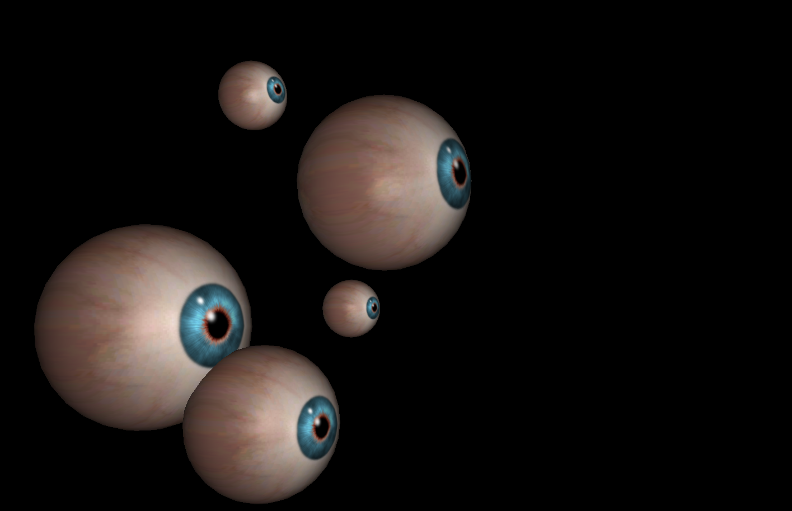
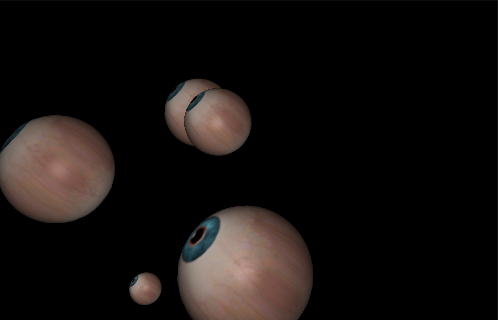

# An exercise which shows that some eyes appear in random position in the scene.

## Introduction

The project is an exercise which required me to creat some eyes and make them could appear in random position. The exercise also required me to make all eyes look at mouse while the mouse is moving. I merely completed some part of the exercise. I could make all eyes only look at the direction of mouse. I failed to make each eye look at mouse.

---

## Code

#### This part explains the code used for the **index.js**

* The following code defines some global variables

```JavaScript
// GLOBALS ======================================================
var camera, scene, renderer;
var image;
var mouseX = 0, mouseY = 0;
var container, stats;
var cubesNum = 10;
var cubes = [];
var windowHalfX = window.innerWidth / 2;
var windowHalfY = window.innerHeight / 2;
```

* The following code creats a scene, container, a camera, renderer.

```JavaScript
// SETUP ========================================================
container = document.createElement( 'div' );
document.body.appendChild( container );

scene = new THREE.Scene();

camera = new THREE.PerspectiveCamera( 40, window.innerWidth / window.innerHeight, 1, 1000 );
camera.position.set( 0, 0, 150 );
scene.add( camera ); // since light is child of camera

scene.add( new THREE.AmbientLight( 0xffffff, 0.2 ) );
var light = new THREE.PointLight( 0xffffff, 1 );
camera.add( light );

renderer = new THREE.WebGLRenderer();
renderer.setPixelRatio( window.devicePixelRatio );
renderer.setSize( window.innerWidth, window.innerHeight );
container.appendChild( renderer.domElement );

document.addEventListener( 'mousemove', onDocumentMouseMove, false );
window.addEventListener( 'resize', onWindowResize, false );
```

* The following code creates material for SphereGeometry firstly. Secondly, the code sets the data of the texture. Thirdly, the code creates mesh to combine the geometry with material, meanwhile clones some and set their position and scale. Fourthly, the code creats **eye** to combine eyeGeometry and material. Finally, the code adds eye to the scene and push eye to **cubes**.

```JavaScript
var material = new THREE.MeshPhongMaterial( {
  color: 0xffffff,
  specular: 0x050505,
  shininess: 50,
  map: THREE.ImageUtils.loadTexture('images/eye.png'),
});

var geometry = new THREE.SphereGeometry( 30, 32, 16 );

// modify UVs to accommodate MatCap texture
var faceVertexUvs = geometry.faceVertexUvs[ 0 ];
for ( i = 0; i < faceVertexUvs.length; i ++ ) {
  var uvs = faceVertexUvs[ i ];
  var face = geometry.faces[ i ];
  for ( var j = 0; j < 3; j ++ ) {
    uvs[ j ].x = face.vertexNormals[ j ].x * 0.5 + 0.5;
    uvs[ j ].y = face.vertexNormals[ j ].y * 0.5 + 0.5;
  }
}

//mesh = new THREE.Mesh( geometry, material );
var eyeGeometry = new THREE.Geometry();
for (var i = 0; i < 5; i++) {

var mesh = new THREE.Mesh(geometry.clone());

mesh.position.x = (Math.random() * 100) - 50;
mesh.position.y = (Math.random() * 100) - 50;
mesh.position.z = (Math.random() * 100) - 50;

mesh.scale.x = Math.random();
mesh.scale.y = mesh.scale.x;
mesh.scale.z = mesh.scale.x;

THREE.GeometryUtils.merge(eyeGeometry, mesh);

//console.log(mesh.position.x);
//console.log(mesh.position.y);

}

var eye = new THREE.Mesh(eyeGeometry, material);

 //eyeRotationX.push(eyeValueX);
 //eyeRotationY.push(eyeValueY);

scene.add( eye );
cubes.push( eye );
```

* In the following functions, it renders each thing.

```JavaScript
function animate() {
	requestAnimationFrame( animate );

	render();

}

function render() {
	//console.log(window.innerHeight)

cubes.forEach(function(c, i){

	c.rotation.x = mouseY/window.innerHeight*2;
	c.rotation.y = mouseX/window.innerWidth*2;

});

	renderer.render( scene, camera );
//console.log(window.innerHeight);
//console.log(window.innerWidth);

}
```

* In the following function, it sets mouse's data.

```JavaScript
function onWindowResize() {
  windowHalfX = window.innerWidth / 2;
  windowHalfY = window.innerHeight / 2;
  camera.aspect = window.innerWidth / window.innerHeight;
  renderer.setSize( window.innerWidth, window.innerHeight );
}

function onDocumentMouseMove( event ) {
  mouseX = event.clientX - windowHalfX;
  mouseY = event.clientY - windowHalfY;

//console.log(event.clientX - windowHalfX);
//console.log(event.clientY - windowHalfY);

}
```

* Run function render

```JavaScript
init();
animate();
```

#### This part explains the code used for the **index.html**

* The following code imports **three.min.js** and **index.js** and **stats.min.js**. For this project, a few dependencies are needed, which can be found in the folder named **libraries**. The **three.min.js** and **stats.min.js** are found in the **Library**.

```JavaScript
<!DOCTYPE html>
<html lang="en" >
  <head>
    <meta charset="UTF-8" />
    <title>Three.js</title>
      <!--  Simple reset to delete the margins  -->
      <style>
        body { margin: 0; }
        canvas { width: 100%; height: 100% }
      </style>
      <!--  Three.js CDN  -->
      <!-- <script src="https://cdnjs.cloudflare.com/ajax/libs/three.js/96/three.min.js"></script>-->
      <script src="build/three.min.js"></script>
      <script src="js/libs/stats.min.js"></script>
  </head>
  <body>
    <!--  Our code  -->
    <script src="js/index.js"></script>
  </body>
</html>
```

---

## The final general view of code
  <p align="center">
  
  
  </p>
