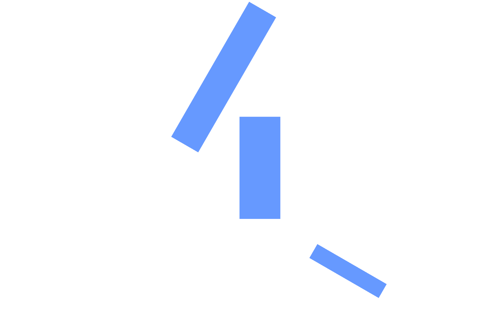
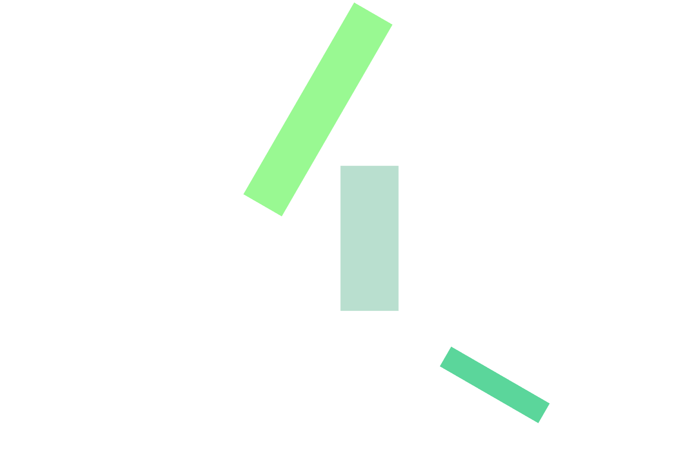
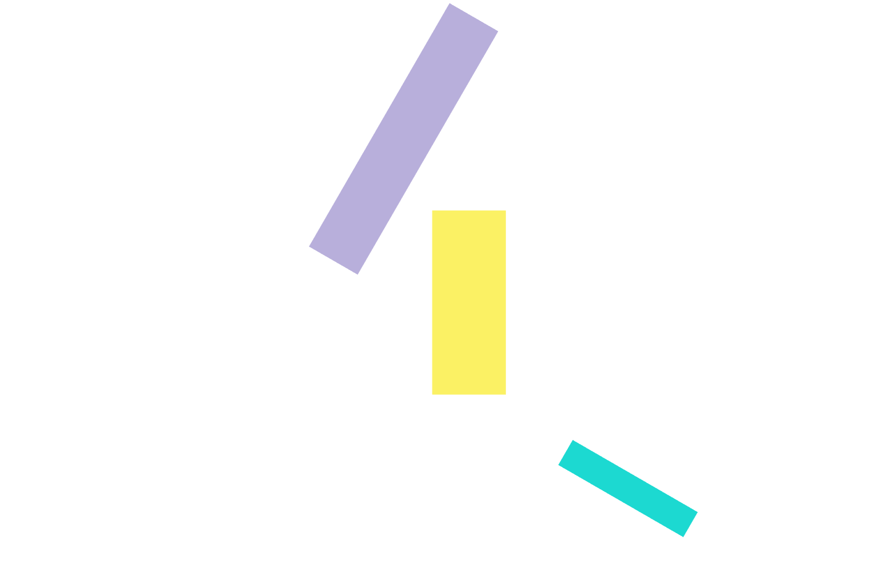

# An exercise which shows three sprites in the scene.

## Introduction

The project is an exercise which required me to make each sprite's color could be change when the mouse moves on the sprite.

---

## Code

#### This part explains the code used for the **index.js**

* The following code defines some global variables

```JavaScript
// GLOBALS ======================================================
var renderer, scene, camera;
var controls, group;

var raycaster = new THREE.Raycaster();
var mouseVector = new THREE.Vector3();

//Boolean (true or false) to show if an object has been selected
var selectedObject = null;
```

* The following code creats a scene, a group, a camera, renderer, controls.

```JavaScript
// init renderer
renderer = new THREE.WebGLRenderer( { antialias: true } );
renderer.setPixelRatio( window.devicePixelRatio );
renderer.setSize( window.innerWidth, window.innerHeight );
document.body.appendChild( renderer.domElement );

// init scene
scene = new THREE.Scene();
scene.background = new THREE.Color( 0xffffff );

group = new THREE.Group();
scene.add( group );

// init camera
camera = new THREE.PerspectiveCamera( 50, window.innerWidth / window.innerHeight, 1, 1000 );
camera.position.set( 15, 15, 15 );
camera.lookAt( scene.position );

controls = new THREE.OrbitControls( camera, renderer.domElement );
controls.enableRotate = true;
```

* The following code creates material and Sprite, meanwhile it combines them firstly. Secondly, the code sets rotation, position, center, scale of sprites. Thirdly, the code adds sprite to **group**.

```JavaScript
// add sprites
var sprite = new THREE.Sprite( new THREE.SpriteMaterial( { color: '#69f' } ) );
sprite.position.set( 6, 5, 5 );
sprite.scale.set( 2, 5, 1 );
group.add( sprite );

var sprite = new THREE.Sprite( new THREE.SpriteMaterial( { color: '#69f' } ) );
sprite.material.rotation = Math.PI / 3 * 4;
sprite.position.set( 8, - 2, 2 );
sprite.center.set( 0.5, 0 );
sprite.scale.set( 1, - 5, 1 );
group.add( sprite );

var sprite = new THREE.Sprite( new THREE.SpriteMaterial( { color: '#69f' } ) );
sprite.position.set( 0, 2, 5 );
sprite.scale.set( 10, 2, 3 );
sprite.center.set( - 0.1, 0 );
sprite.material.rotation = Math.PI / 3;
group.add( sprite );
```

* In the following functions, it renders each thing.

```JavaScript
function animate() {
  renderer.render( scene, camera );
  requestAnimationFrame( animate );
}
```

* In the following function, it sets window size.

```JavaScript
function onWindowResize() {
  camera.aspect = window.innerWidth / window.innerHeight;
  camera.updateProjectionMatrix();
  renderer.setSize( window.innerWidth, window.innerHeight );
}
```

* In the following function, it sets data of mousemove. It makes sprites be changed to random color by moving mouse on sprites.

```JavaScript
function onDocumentMouseMove( event ) {
  event.preventDefault();
  if ( selectedObject ) {

    selectedObject = null;
  }


  var intersects = getIntersects( event.layerX, event.layerY );
  if ( intersects.length > 0 ) {
    var res = intersects.filter( function ( res ) {
      return res && res.object;
    } )[ 0 ];
    if ( res && res.object ) {
      selectedObject = res.object;
      selectedObject.material.color.set( Math.random() * 0xFFFFFF );
    //console.log(selectedObject.position);
    }
  }
}

function getIntersects( x, y ) {
  x = ( x / window.innerWidth ) * 2 - 1;
  y = - ( y / window.innerHeight ) * 2 + 1;
  mouseVector.set( x, y, 0.5 );
  raycaster.setFromCamera( mouseVector, camera );
  return raycaster.intersectObject( group, true );
}
```

* Run function render

```JavaScript
init();
animate();
```

#### This part explains the code used for the **index.html**

* The following code imports **three.js** and **index.js** and **OrbitControls.js**. For this project, a few dependencies are needed, which can be found in the folder named **libraries**. The **three.js** and **OrbitControls.js** are found in the **Library**.

```JavaScript
<!DOCTYPE html>
<html lang="en">
	<head>
		<title>three.js webgl - raycast - sprite</title>
		<meta charset="utf-8">
		<meta name="viewport" content="width=device-width, user-scalable=no, minimum-scale=1.0, maximum-scale=1.0">
		<style>
			body {
				font-family: Monospace;
				font-size: 13px;
				text-align: center;

				margin: 0px;
				background-color: #fff;
				overflow: hidden;
			}

			#info{
				position: absolute;
				z-index: 1;
				width: 100%;
				padding: 5px;
				text-align: center;
			}
		</style>
	</head>
<body>
	<script src="build/three.js"></script>
	<script src="js/OrbitControls.js"></script>
	<script src="js/index.js"></script>
</body>
</html>
```

---

## The final general view of code
  <p align="center">
  
  
  
  </p>
