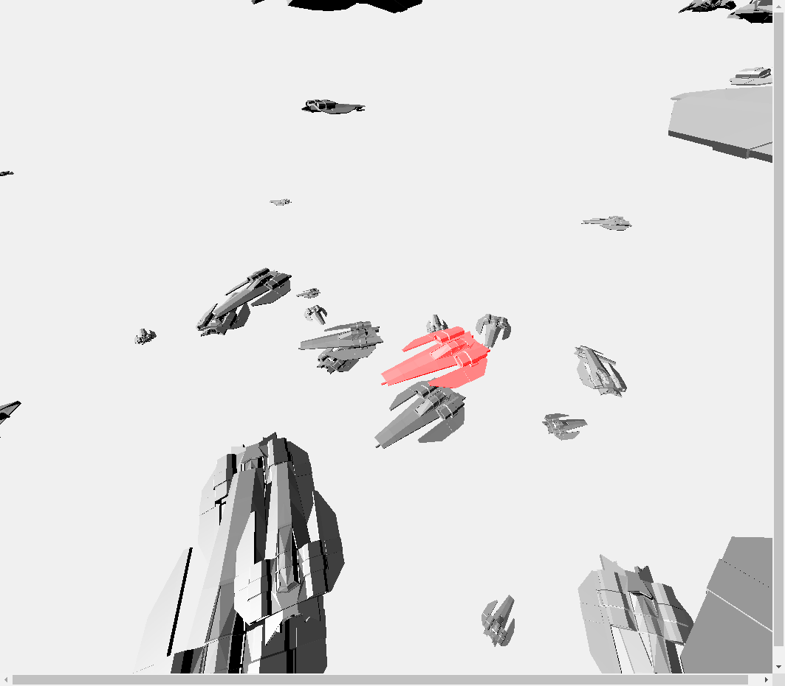

# An exercise which shows many ships in the scene.

## Introduction

The project is an exercise which required me to give each ship random vioce when I move mouse on the ships. I choice three vioces of piano for object.

---

## Code

#### This part explains the code used for the **index.js**

* The following code defines some global variables

```JavaScript
// GLOBALS ======================================================
var container, stats;
var camera, scene, raycaster, renderer;

var mouse = new THREE.Vector2(), INTERSECTED;
var radius = 100, theta = 0;
var object;

var objects = [];

// create an AudioListener and add it to the camera
var listener = new THREE.AudioListener();

// create a global audio source
var sound = new THREE.Audio( listener );

// load a sound and set it as the Audio object's buffer
var audioLoader = new THREE.AudioLoader();
```

* The following code creats a scene, a camera, container, light.

```JavaScript
container = document.createElement( 'div' );
document.body.appendChild( container );

camera = new THREE.PerspectiveCamera( 100, window.innerWidth / window.innerHeight, 1, 10000 );

//Audio - Settings
camera.add( listener );

scene = new THREE.Scene();
scene.background = new THREE.Color( 0xf0f0f0 );

var light = new THREE.DirectionalLight( 0xffffff, 1 );
light.position.set( 1, 1, 1 ).normalize();
scene.add( light );
```

* The following code creates audioLoader to load random music firstly. secondly, the code creats material and geometry, meanwhile it loads **Blocks.mtl** and **ship.obj** firstly. Thirdly, the code creats mesh to combin material and geometry, meanwhile it sets scale, position, rotation of the mesh. Fourthly, the code adds mesh to scene and push mesh to **object**. Fifthly, the code creats raycaster and renderer.

```JavaScript
var geometry = new THREE.BoxBufferGeometry( 20, 20, 20 );

var audioLoader = new THREE.AudioLoader();
  audioLoader.load( "audio/music" + Math.floor(Math.random()*2) + ".mp3", function( buffer ) {
  sound.setBuffer( buffer );
  sound.setLoop( false );
  sound.setVolume( 0.5 );
  sound.play();
});

for (var i=0; i<100; i++){
// Model/material loading!
var mtlLoader = new THREE.MTLLoader();
mtlLoader.load("Blocks.mtl", function(materials){

  materials.preload();

  var objLoader = new THREE.OBJLoader();
  objLoader.setMaterials(materials);

    objLoader.load("ship.obj", function(mesh){
      mesh.traverse(function(node){
        if( node instanceof THREE.Mesh ){
          node.castShadow = true;
          node.receiveShadow = true;
        }
      });
      var sizeRand = Math.random() * 0.5;
      mesh.scale.set(sizeRand,sizeRand,sizeRand);
      mesh.position.set(Math.random()*800-400, Math.random()*800-400, Math.random()*800-400);
      mesh.rotation.y = -Math.PI/Math.random()*4;

      scene.add(mesh);
      objects.push(mesh); //Add to the array so that we can access for raycasting
    });
  });
}

raycaster = new THREE.Raycaster();

renderer = new THREE.WebGLRenderer();
renderer.setPixelRatio( window.devicePixelRatio );
renderer.setSize( window.innerWidth, window.innerHeight );
container.appendChild( renderer.domElement );

//stats = new Stats();
//container.appendChild( stats.dom );
document.addEventListener( 'mousemove', onDocumentMouseMove, false );
window.addEventListener( 'resize', onWindowResize, false );
```

* In the following functions, it renders each thing and gives object random voice.

```JavaScript
function onWindowResize() {
  camera.aspect = window.innerWidth / window.innerHeight;
  camera.updateProjectionMatrix();
  renderer.setSize( window.innerWidth, window.innerHeight );
}

function onDocumentMouseMove( event ) {
  event.preventDefault();
  mouse.x = ( event.clientX / window.innerWidth ) * 2 - 1;
  mouse.y = - ( event.clientY / window.innerHeight ) * 2 + 1;
}

//
function animate() {
  requestAnimationFrame( animate );

  render();
  //stats.update();
}

function render() {
  //Auto rotate camera
  theta += 0.1;
  camera.position.x = radius * Math.sin( THREE.Math.degToRad( theta ) );
  camera.position.y = radius * Math.sin( THREE.Math.degToRad( theta ) );
  camera.position.z = radius * Math.cos( THREE.Math.degToRad( theta ) );
  camera.lookAt( scene.position );
  camera.updateMatrixWorld();

  //Find intersections
  raycaster.setFromCamera( mouse, camera );
  //var intersects = raycaster.intersectObjects( scene.children );

  var intersects = raycaster.intersectObjects( objects, true );

  if ( intersects.length > 0 ) {
    if ( INTERSECTED != intersects[ 0 ].object ) {
      if ( INTERSECTED ) INTERSECTED.material.emissive.setHex( INTERSECTED.currentHex );
      INTERSECTED = intersects[ 0 ].object;
      INTERSECTED.currentHex = INTERSECTED.material.emissive.getHex();
      INTERSECTED.material.emissive.setHex( 0xff0000 );

        audioLoader.load( "audio/music" + Math.floor(Math.random()*2) + ".mp3", function( buffer ) {
        sound.setBuffer( buffer );
        sound.setLoop( false );
        sound.setVolume( 0.5 );
        sound.play();
      });

    }
  } else {
    if ( INTERSECTED ) INTERSECTED.material.emissive.setHex( INTERSECTED.currentHex );
    INTERSECTED = null;

  }
  renderer.render( scene, camera );
}
```

* Run function render

```JavaScript
init();
animate();
```

#### This part explains the code used for the **index.html**

* The following code imports **three.js** and **index.js** and **OBJLoader.js** and **MTLLoader.js**. For this project, a few dependencies are needed, which can be found in the folder named **libraries**. The **three.js** and **OBJLoader.js** and **MTLLoader.js** are found in the **Library**.

```JavaScript
<!DOCTYPE html>
<html lang="en" >
  <head>
    <meta charset="UTF-8" />
    <title>Three.js</title>
      <!--  Simple reset to delete the margins  -->
      <style>
        body { margin: 0; }
        canvas { width: 100%; height: 100% }
      </style>
      <!--  Three.js CDN  -->
      <!-- <script src="https://cdnjs.cloudflare.com/ajax/libs/three.js/96/three.min.js"></script>-->
      <script src="build/three.min.js"></script>
      <script src="build/OBJLoader.js"></script>
      <script src="build/MTLLoader.js"></script>

  </head>
  <body>
    <!--  Our code  -->
    <script src="js/index.js"></script>
  </body>
</html>
```

---

## The final general view of code
  <p align="center">
  
  </p>
