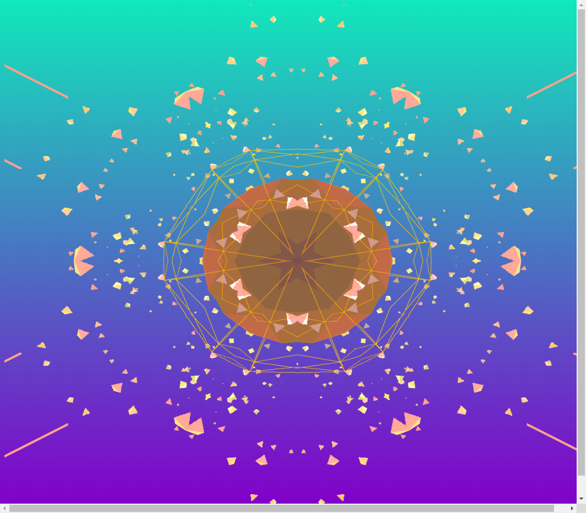
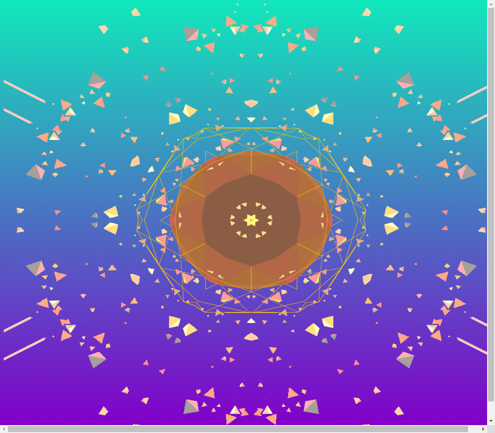

# An exercise which shows some geometry and special effects in the scene.

## Introduction

The project is an exercise which required me to change effects for the scene.

---

## Code

#### This part explains the code used for the **index.js**

* The following code defines some global variables

```JavaScript
// GLOBALS ======================================================
var renderer, scene, camera, composer, planetMesh, skeletonMesh, particleMesh;
var effectGlitch, effectRGB, motion1, motion2;
var kaleidoParams, kaleidoPass;
var rgbPass, rgbParams;
var t1 = 0;
var t2 = 0;
var t3 = 0;

var glitchPass;
```

* The following code creats a scene, a camera, renderer.

```JavaScript
renderer = new THREE.WebGLRenderer({ antialias: true, alpha: true });
renderer.setPixelRatio((window.devicePixelRatio) ? window.devicePixelRatio : 1);
renderer.setSize(window.innerWidth, window.innerHeight);
renderer.autoClear = false;
renderer.setClearColor(0x000000, 0.0);
document.getElementById('canvas').appendChild(renderer.domElement);

scene = new THREE.Scene();

camera = new THREE.PerspectiveCamera(75, window.innerWidth / window.innerHeight, 1, 1000);
camera.position.z = 400;
scene.add(camera);
```

* The following code creates planetObject, skeletonObject, particlesObject and adds them to scene firstly. Secondly, the code creats particlesGeometry, planetGeometry, skeletonGeometry and particlesMaterial. Thirdly, the code sets their position and creats mesh to combin geometry and material. Fourthly, the code creats lights to render objects in the scene. Finally, the code creats special effects for the scene.

```JavaScript
planetObject = new THREE.Object3D();
skeletonObject = new THREE.Object3D();
particlesObject = new THREE.Object3D();

scene.add(planetObject);
scene.add(skeletonObject);
scene.add(particlesObject);

var particlesGeometry = new THREE.TetrahedronGeometry(2, 0);
var planetGeometry = new THREE.IcosahedronGeometry(7, 1);
var skeletonGeometry = new THREE.IcosahedronGeometry(15, 1);

var particlesMaterial = new THREE.MeshPhongMaterial({
  color: 0xffffff,
  shading: THREE.FlatShading
});

for (var i = 0; i < 1500; i++) {
  var particlesMesh = new THREE.Mesh(particlesGeometry, particlesMaterial);
  particlesMesh.position.set(Math.random() - 0.5, Math.random() - 0.5, Math.random() - 0.5).normalize();
  particlesMesh.position.multiplyScalar(1 + (Math.random() * 700));
  particlesMesh.rotation.set(Math.random() * 2, Math.random() * 2, Math.random() * 2);
  var randScale = Math.random() * 5;
  particlesMesh.scale.set(randScale, randScale, randScale);
  particlesObject.add(particlesMesh);
}

var planetMaterial = new THREE.MeshPhongMaterial({
  color: 0xffffff,
  shading: THREE.FlatShading
});

var planetMesh = new THREE.Mesh(planetGeometry, planetMaterial);
planetMesh.scale.x = planetMesh.scale.y = planetMesh.scale.z = 16;
planetObject.add(planetMesh);

var skeletonMaterial = new THREE.MeshPhongMaterial({
  color: 0xffffff,
  wireframe: true,
  side: THREE.DoubleSide
});

var skeletonMesh = new THREE.Mesh(skeletonGeometry, skeletonMaterial);
skeletonMesh.scale.x = skeletonMesh.scale.y = skeletonMesh.scale.z = 10;
skeletonObject.add(skeletonMesh);

var ambientLight = new THREE.AmbientLight(0x999999 );
scene.add(ambientLight);

//set color and position of light
var lights = [];
lights[0] = new THREE.DirectionalLight( 0xffffff, 0.2 );
lights[0].position.set( 1, 2, -0.5);
lights[1] = new THREE.DirectionalLight( 0x11E8BB, 0.3 );
lights[1].position.set( 1, -1, 0.5 );
lights[2] = new THREE.DirectionalLight( 0x8200C9, 0.7 );
lights[2].position.set( -1., -1, -0.1 );
lights[3] = new THREE.DirectionalLight( 0x8200C9, 0.8 );
lights[3].position.set( -1., 2, -1 );
scene.add( lights[0] );
scene.add( lights[1] );
scene.add( lights[2] );
scene.add( lights[3] );

// postprocessing
composer = new THREE.EffectComposer( renderer );
//composer.addPass( new THREE.RenderPass( scene, camera ) );
var renderPass = new THREE.RenderPass(scene, camera);

//here to change effect
rgbPass = new THREE.ShaderPass( THREE.HueSaturationShader);
//rgbPass.uniforms[ 'amount' ].value = 0.005;
//rgbPass.renderToScreen = true;
composer.addPass ( renderPass );
composer.addPass ( rgbPass );

//here to change effect
kaleidoPass = new THREE.ShaderPass (THREE.KaleidoShader);
composer.addPass ( kaleidoPass );

var glitchPass = new THREE.GlitchPass();
glitchPass.renderToScreen = true;
composer.addPass( glitchPass );

rgbParams = {
  amount: 0.5,
  angle: 0.0
}

kaleidoParams = {
  sides: 2,
  angle: 0.0
}

  window.addEventListener('resize', onWindowResize, false);
```

* In the following functions, it renders each thing.

```JavaScript
function onWindowResize() {
  camera.aspect = window.innerWidth / window.innerHeight;
  camera.updateProjectionMatrix();
  renderer.setSize(window.innerWidth, window.innerHeight);
  composer.setSize( window.innerWidth, window.innerHeight );
}

var reset = 0;

function animate(ts) {
  requestAnimationFrame(animate);
  //var delta = clock.getDelta()

  particlesObject.rotation.x += 0.0000;
  particlesObject.rotation.y -= 0.0040;
  planetObject.rotation.x -= 0.0020;
  planetObject.rotation.y -= 0.0030;
  skeletonObject.rotation.x -= 0.0010;
  skeletonObject.rotation.y += 0.0020;
  //renderer.clear();

  //renderer.render( scene, camera )
  composer.render(0.1);
};
```

* Run function render

```JavaScript
window.onload = function() {
  init();
  animate();
}
```

#### This part explains the code used for the **index.html**

* The following code imports **three.js** and **index.js** and **/OBJLoader.js** and **MTLLoader.js**. For this project, a few dependencies are needed, which can be found in the folder named **libraries**. The **three.js** and **OBJLoader.js** and **MTLLoader.js** are found in the **Library**.

```JavaScript
<!DOCTYPE html>
<html lang="en" >
  <head>
    <meta charset="UTF-8" />
    <title>Three.js</title>
      <!--  Simple reset to delete the margins  -->
      <style>
        body { margin: 0; }
        canvas { width: 100%; height: 100% }
      </style>
      <!--  Three.js CDN  -->
      <!-- <script src="https://cdnjs.cloudflare.com/ajax/libs/three.js/96/three.min.js"></script>-->
      <script src="build/three.min.js"></script>
      <script src="build/OBJLoader.js"></script>
      <script src="build/MTLLoader.js"></script>

  </head>
  <body>
    <!--  Our code  -->
    <script src="js/index.js"></script>
  </body>
</html>
```

---

## The final general view of code
  <p align="center">
  
  
  
  
  </p>
